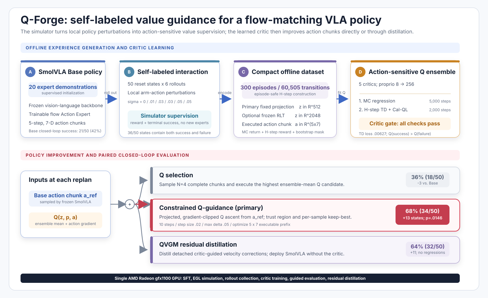
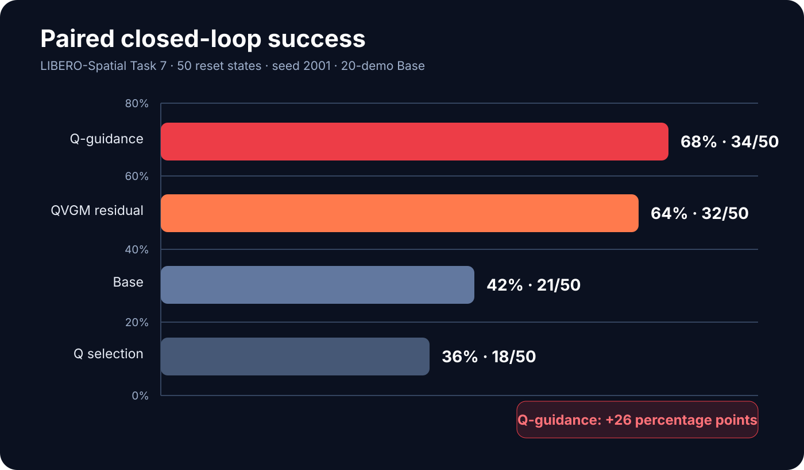

# Q-Forge

## Self-Labeled Q-Guidance for SmolVLA on AMD Radeon

Q-Forge improves a vision-language-action robot policy without collecting
additional expert demonstrations. A SmolVLA base policy generates perturbed
rollouts, the simulator labels each trajectory through task reward and success,
a conservative Q ensemble learns from those outcomes, and constrained Q-guidance
makes small value-increasing corrections to the policy's action chunks.

The complete pipeline—SmolVLA fine-tuning, LIBERO rollout collection, critic
training, Q-guided evaluation, residual distillation, and attention
benchmarking—was run on one AMD Radeon `gfx1100` GPU with 48 GiB VRAM.

## Award

Q-Forge won the **Excellent Award** at **AMD AI DevMaster 2026**.




## Demo video

[Watch the 4-minute-39-second Q-Forge demonstration](video/Q-Forge-demo.mp4).
It includes the real paired state-1 rollout, English narration, burned-in English
subtitles, result evidence, and the AMD Radeon engineering summary. The editable
[storyboard](video/storyboard.md), [narration](video/narration.txt), and
[SRT subtitles](video/subtitles.srt) are included.

## Headline result

On the paired 50-state LIBERO-Spatial Task 7 evaluation, using the same reset
states and inference seed for every method:

| Method | Success | Wilson 95% CI | Paired change vs. Base |
|---|---:|---:|---:|
| 20-demo SmolVLA Base | 21/50 (42%) | 29.38%–55.77% | — |
| Q selection, N=4 | 18/50 (36%) | 24.14%–49.86% | −3 states |
| **Q-guidance** | **34/50 (68%)** | **54.19%–79.24%** | **+13 states; p=0.0146** |
| QVGM residual distillation | 32/50 (64%) | 50.14%–75.86% | +11/−0; p=0.00098 |

Q-guidance converts 19 Base failures into successes while regressing on 6 Base
successes: a net gain of 13 successful states, or 26 percentage points. The
two-sided p-values use the exact McNemar test over paired reset-state outcomes.



These numbers describe the fixed protocol documented below: one LIBERO task,
50 reset states, and paired inference seed 2001. They are not presented as a
multi-task or multi-seed generalization claim.

## Why the critic data matters

The decisive intervention was better local action coverage. For each of 50 reset
states, the Base policy produced six rollouts under small action perturbations,
yielding 300 episodes and 60,505 transitions. Thirty-six states then contained
both successful and failed outcomes. This gives the critic local evidence about
which action directions change an outcome, rather than merely teaching it which
initial states are easy.

With the resulting 300-rollout critic:

- held-out TD loss is `0.00627`, below the predefined `0.01` gate;
- `Q(success)=0.421 > Q(failure)=0.234`;
- `Q(dataset)=0.288 > Q(random)=-0.361`;
- action gradients are finite and non-zero;
- all 12 constrained-guidance grid configurations pass the gate.

The selected configuration is `steps=10`, `step_size=0.02`, and
`max_delta=0.05`. On 12,124 validation transitions it increases predicted Q by
`0.0446` on average, improves every transition, and increases action saturation
by only `0.31` percentage points.

## Methods compared

- **Q selection:** sample four policy chunks and execute the one with the highest
  ensemble-mean Q. It did not improve closed-loop success in this setting.
- **Q-guidance:** projected, gradient-clipped Q ascent from the Base action inside
  a small trust region. This is the primary and best-performing method.
- **QVGM residual:** distill critic-generated corrections into the SmolVLA
  velocity field. Deployment uses the same policy architecture and no critic; it
  reached 64% and did not break any Base-success state in this paired evaluation.

## AMD Radeon engineering

The tested server reports:

```text
Architecture: gfx1100 (Navi 31 class)
Compute units: 96
VRAM:         48 GiB
ROCm runtime: 7.2.4
PyTorch:      2.8.0+rocm6.4
```

The PyTorch wheel carries a ROCm 6.4 build tag and runs on the server's newer
runtime/driver stack. `scripts/verify_rocm_torch.py` prints authoritative values.

An initial QVGM residual run hit a native `SIGSEGV` in the frozen FP32 critic
path. The stable implementation uses PyTorch SDPA MATH for training and computes
detached Q-guidance targets with the frozen critic on CPU. A separate attention
benchmark led to a workload-specific backend choice:

- CK FlashAttention for forward-only inference and rollout;
- PyTorch SDPA for backward and full training steps;
- Triton when lower peak memory is more important than speed.

See [AMD/ROCm notes](docs/AMD_ROCM.md) and the
[technical report](docs/TECHNICAL_REPORT.md).

## Repository map

```text
configs/       LIBERO, RLinf, and experiment configurations
constraints/   tested torch constraints
patches/       small upstream compatibility patches
scripts/       SFT, collection, critic, guidance, evaluation, and benchmark CLIs
src/           Q-Forge Python package
tests/         unit and protocol tests
assets/        architecture and result figures
results/       compact auditable summaries, without checkpoints or logs
docs/          report, reproduction, data, result, and AMD notes
video/         storyboard, narration, subtitles, and final demo
```

Large models, rollout datasets, caches, logs, and training outputs are excluded
from Git. Commands preserve their conventional local paths under `checkpoints/`,
`data/`, and `outputs/`.

## Quick verification

The project uses Python 3.11. Start from an AMD ROCm PyTorch environment:

```bash
python -m pip install -e .
python scripts/verify_rocm_torch.py
python -m pytest -q
```

LIBERO evaluation additionally requires compatible checkouts of LIBERO-sim,
LeRobot 0.4.1, and RLinf 0.3.0. Configure their locations rather than copying
them into this repository:

```bash
export PYTHONPATH=/path/to/LIBERO-sim${PYTHONPATH:+:$PYTHONPATH}
export LIBERO_CONFIG_PATH="$PWD/configs/libero"
export MUJOCO_GL=egl
export PYOPENGL_PLATFORM=egl
export SMOLVLA_ATTENTION_BACKEND=sdpa
```

See [docs/REPRODUCTION.md](docs/REPRODUCTION.md) for exact setup, artifact
layout, a short smoke path, and full reproduction.

## Primary evaluation command

After preparing the 20-demo Base checkpoint and 300-rollout Cal-QL critic:

```bash
python scripts/run_smolvla_libero_sweep.py \
  --states 0-49 --seeds 2001 \
  --task-suite libero_spatial --task-id 7 \
  --max-steps 240 --action-steps 5 \
  --model-path checkpoints/smolvla_20d_base/pretrained_model \
  --critic-checkpoint checkpoints/qforge_300p_critic/checkpoint-final.pt \
  --critic-mode guidance \
  --guidance-steps 10 --guidance-step-size 0.02 \
  --guidance-max-delta 0.05 \
  --guidance-optimize-prefix-steps 5 \
  --guidance-optimize-action-dims 7 \
  --output-dir outputs/qforge_300p/q_guidance_seed2001
```

## Documentation

- [Technical report](docs/TECHNICAL_REPORT.md)
- [Reproduction guide](docs/REPRODUCTION.md)
- [Dataset and split documentation](docs/DATA.md)
- [AMD/ROCm implementation notes](docs/AMD_ROCM.md)
- [Audited results](docs/RESULTS.md)
- [Demo storyboard](video/storyboard.md)

## Limitations

The controlled study focuses on one LIBERO task and a fixed paired inference
seed. Guidance hyperparameters are selected using reset states 40–49, which are
also included in the reported full 50-state benchmark; this is not a separately
held-out test-state result. No real-robot result is claimed. The simulator supplies
automatic success labels, and extra policy interaction still costs compute even
though it requires no additional human demonstrations.

## Team

**Yuhao Cao** — sole developer; project conception, system design,
implementation, AMD ROCm adaptation, experimentation, evaluation, and
documentation. GitHub: [ZorAttC](https://github.com/ZorAttC).

## License and acknowledgements

Original Q-Forge code is released under Apache-2.0. LIBERO, LeRobot, RLinf,
SmolVLA, PyTorch, and FlashAttention remain subject to their own licenses. See
[THIRD_PARTY_NOTICES.md](THIRD_PARTY_NOTICES.md).
