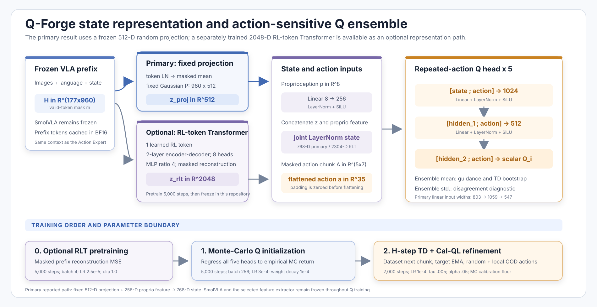

# Q-Forge: Self-Labeled Q-Guidance for Flow-Matching Vision-Language-Action Policies on AMD Radeon

**Technical Report**<br>
**Author:** Yuhao Cao<br>
**Repository:** `ZorAttC/Q-Forge`<br>
**Application Area:** Physical AI / Robotic Manipulation

## Abstract

Vision-Language-Action (VLA) policies can acquire broad perceptual and semantic priors through pretraining, yet their downstream manipulation performance remains strongly constrained by the quantity and coverage of expert demonstrations. Collecting additional teleoperated trajectories is costly, while supervised fine-tuning alone provides no direct mechanism for distinguishing locally better actions from locally worse ones at states visited by the learned policy.

This report presents **Q-Forge**, a self-labeling policy-improvement pipeline for the flow-matching SmolVLA policy. Q-Forge begins with a SmolVLA-450M model fine-tuned on 20 LIBERO demonstrations. The policy then collects 300 simulator rollouts under small action perturbations; task rewards and terminal success signals automatically label the resulting experience without additional expert annotation. A conservative five-member Q ensemble is trained on compact frozen VLA features and five-step action chunks, first through Monte Carlo regression and then through H-step temporal-difference learning with Cal-QL-style regularization. At deployment, projected Q-gradient ascent modifies each action chunk within a bounded trust region. An optional Q-value gradient-matching residual objective distills these corrections into the policy, thereby removing the critic from the inference path.

In a paired evaluation over 50 reset states of LIBERO-Spatial task 7, using identical inference seeds for every method, the 20-demonstration Base policy succeeds on 21/50 states (42%), whereas Q-guidance succeeds on 34/50 states (68%). Q-guidance converts 19 Base failures into successes while degrading 6 Base successes, yielding a net gain of 13 states and 26 percentage points (`p=0.0146`, exact two-sided McNemar test). Critic-free residual distillation reaches 32/50 (64%), whereas gradient-free Q selection reaches 18/50 (36%). A second controlled replication on task 3 of the same suite (*pick up the black bowl on the cookie box and place it on the plate*) yields 38/50 (76%) for Base, 44/50 (88%) for Q-guidance with no successful-state regressions (`p=0.03125`), 43/50 (86%) for residual distillation, and 35/50 (70%) for Q selection—reproducing on a second task the same method ranking observed on task 7. The complete pipeline, including policy training, simulator data collection, critic learning, guidance evaluation, residual distillation, and attention benchmarking, is executed on a single AMD Radeon `gfx1100` GPU with 48 GiB of VRAM.

**Keywords:** vision-language-action models, robot learning, offline reinforcement learning, flow matching, Q-guidance, self-labeled data, LIBERO, ROCm

## 1. Introduction

Recent VLA models formulate robot control as conditional sequence generation: visual observations, language instructions, and proprioceptive states are mapped to discrete actions, continuous actions, or short action chunks. Scaling this paradigm has produced policies with increasingly broad semantic capabilities, but downstream adaptation still depends heavily on expert demonstrations. This dependence introduces two interrelated limitations.

First, expert datasets typically cover successful nominal behavior rather than the distribution induced by the learned policy. Small errors can therefore lead the robot into states for which the policy lacks corrective supervision. Second, behavior cloning treats demonstrated actions as targets but does not explicitly estimate whether nearby alternatives would improve long-horizon task outcomes. Merely sampling more actions from the same policy cannot resolve this issue unless the system can evaluate and exploit their relative quality.

Simulation provides a practical route to additional supervision. A policy can interact with an environment that assigns rewards and success labels without human annotation. Arbitrarily collecting policy rollouts, however, is insufficient. If every trajectory from a given initial state has the same outcome, the learned critic may primarily identify easy and difficult states rather than action-sensitive local structure. Q-Forge therefore emphasizes **same-state action coverage**: multiple trajectories begin from each reset state and are diversified by controlled perturbations to policy actions. The resulting mixture of successes and failures provides local evidence about which action directions alter task outcomes.

Q-Forge investigates the following question:

> Can automatically labeled, policy-generated interaction data be transformed into reliable local action corrections for a compact flow-matching VLA policy without collecting additional expert demonstrations?

The project makes five principal contributions:

1. It implements an end-to-end self-labeling improvement loop around SmolVLA, covering simulator interaction, feature caching, offline critic training, test-time guidance, and residual policy distillation.
2. It introduces a structured local-perturbation collection protocol that creates outcome diversity from fixed reset states, and demonstrates that this coverage matters more than simply optimizing longer on a smaller dataset.
3. It develops a bounded action-chunk guidance procedure with gradient clipping, action-range projection, a Base-centered trust region, and a per-sample best-so-far safeguard.
4. It compares three uses of the same learned value signal: candidate selection, direct gradient guidance, and critic-free residual distillation.
5. It documents the systems engineering required to run the complete workflow on AMD ROCm, including stage-specific attention-backend selection and a stable CPU critic path for detached residual targets.

The empirical claims are deliberately narrow: the primary study covers one LIBERO task, 50 reset states, and one paired inference seed. The results demonstrate controlled within-task improvement rather than generalization across many tasks, seeds, real robots, or simulation-to-reality settings.

## 2. Related Work

### 2.1 Vision-Language-Action Policies

RT-1 [1] demonstrated that Transformer policies can scale to real-world robot control across many tasks; RT-2 [2] formulated robot actions as another output modality of a vision-language model and investigated the transfer of web-scale semantic knowledge to control. OpenVLA [3] further established an open VLA model and training ecosystem. These systems advanced the view of semantic perception and low-level action generation as a unified model, but their adaptation quality still depends on robot data and the downstream optimization procedure.

SmolVLA [4] is a compact 450M-parameter VLA designed for affordable and efficient robotics. It combines a frozen or partially frozen vision-language backbone with an Action Expert that generates continuous action chunks through flow matching. Q-Forge adopts SmolVLA because its compact architecture is practical on a single GPU and its continuous action generator supports value-gradient-based local optimization. Q-Forge does not replace the SmolVLA architecture; instead, it adds an interaction-driven value-learning and policy-improvement layer around it.

### 2.2 Generative Policies and Flow Matching

Diffusion Policy [5] showed that expressive generative models can effectively capture multimodal visuomotor behavior and action-sequence prediction. Flow Matching [6] provides a simulation-free objective for learning continuous vector fields that transport samples between distributions. In robotic action policies, a model can integrate a learned velocity field from noise to obtain a structured action chunk.

Generative policies are expressive, but conventional policy-gradient or actor-critic updates are less direct than for explicit deterministic actors. Backpropagating through every denoising step is expensive and potentially unstable, while likelihood-based policy improvement may not be available in a convenient form. Q-Forge instead studies local optimization in executable action space and the distillation of critic-induced corrections into the velocity field.

### 2.3 Offline Reinforcement Learning and Conservative Value Estimation

Offline reinforcement learning learns from a fixed interaction dataset and must avoid assigning unrealistically high values to actions outside the data support. Conservative Q-Learning (CQL) [7] addresses this issue by penalizing high values for sampled out-of-distribution actions relative to dataset actions. Cal-QL [8] augments conservative pretraining with calibration so that learned values remain appropriately scaled relative to a reference policy.

Q-Forge applies these ideas in a lightweight action-chunk critic. Uniformly random action chunks and locally perturbed chunks around behavior actions form the conservative candidates, while Monte Carlo returns provide a calibration lower bound. This report does not claim that the critic is globally accurate; its training objective is to provide useful local rankings and gradients near the policy distribution. Ensemble disagreement and held-out diagnostics are therefore treated as necessary checks rather than proofs of correctness.

### 2.4 Q-Guided Flow-Matching Policy Improvement

Q-VGM [9] develops Q-value gradient matching for off-policy reinforcement learning with flow-matching VLA policies. Its central insight is that critic gradients can define useful corrections for a flow policy without differentiating through the complete denoising trajectory at deployment.

Q-Forge is an independent systems implementation and controlled study inspired by this direction. Its emphasis is the construction of a complete loop around SmolVLA on AMD hardware: self-labeled local rollout collection, a compact frozen-prefix critic, constrained test-time action ascent, paired closed-loop evaluation, and optional residual distillation. Direct Q-guidance is the primary method; residual value-gradient matching is evaluated as a deployment-oriented alternative.

### 2.5 Robot-Learning Benchmarks

LIBERO [10] is a benchmark for knowledge transfer and lifelong robotic manipulation. It provides language-conditioned simulation tasks, demonstrations, and reproducible initial states. Q-Forge uses LIBERO-Spatial task 7—*pick up the black bowl on the stove and place it on the plate*—as the primary controlled environment, and conducts a replication experiment on task 3 of the same suite (*pick up the black bowl on the cookie box and place it on the plate*), with the simulator providing automatic reward and success labels. The benchmark is used here for within-task policy improvement rather than lifelong-learning evaluation.

## 3. Problem Formulation

Let the observation be

```math
o_t=(I_t^{agent}, I_t^{wrist}, p_t, \ell),
```

where the two images depict the scene, `p_t` denotes proprioception, and `\ell` is the language instruction. A flow-matching policy `\pi_\theta` generates an action chunk

```math
a_{t:t+H-1}\in[-1,1]^{H\times D},
```

where the horizon is `H=5` and the executable action dimension is `D=7`. The environment returns rewards and a terminal success indicator. The objective is to improve closed-loop success subject to the following conditions:

- no expert demonstrations beyond the initial supervised dataset;
- preservation of the pretrained VLA representation;
- policy corrections restricted to a small neighborhood around the Base action;
- learning solely from a fixed set of automatically labeled policy rollouts.

The pipeline separates representation, value learning, and action improvement. A frozen SmolVLA prefix provides a compact state feature, the critic estimates returns for candidate action chunks, and guidance modifies only the action variable presented to the critic.

## 4. Q-Forge Method


### 4.1 Base Flow-Matching Policy

The Base policy is SmolVLA-450M fine-tuned through the native LeRobot training path. The vision-language backbone is frozen, and the Action Expert is optimized for 20,000 steps on 20 expert demonstrations.

For a clean normalized action chunk `x_0`, Gaussian noise `x_1`, and interpolation time `t\in[0,1]`, the forward interpolation is

```math
x_t=(1-t)x_0+t x_1.
```

The Action Expert predicts the conditional velocity

```math
v^*(x_t,t)=x_1-x_0
```

and is trained with the flow-matching loss

```math
\mathcal L_{\mathrm{flow}}
=
\mathbb E\left[
\left\|v_\theta(x_t,t,o_t)-(x_1-x_0)\right\|_2^2
\right].
```

At inference, numerical integration starts from noise at `t=1` and proceeds toward an action chunk at `t=0`.

### 4.2 Self-Labeled Local Rollout Collection

The Base policy runs closed-loop in the simulator from reset states 0–49. Six episodes are collected per state, with action-noise standard deviations assigned as follows:

```math
\{0.00,\;0.01,\;0.03,\;0.03,\;0.05,\;0.05\}.
```

At each replanning step, the assigned perturbation is applied to the first six arm-action dimensions with probability `0.5`; the gripper dimension remains unperturbed. The collected dataset contains:

| Quantity | Value |
|---|---:|
| Reset states | 50 |
| Rollouts per state | 6 |
| Episodes | 300 |
| Transitions | 60,505 |
| States containing both successes and failures | 36/50 |

“Self-labeled” means that trajectories are generated by the learned policy and automatically labeled by simulator rewards and terminal success signals. These labels are not model-generated pseudo-labels. No additional human demonstrations or manual trajectory annotation are used.

The repeated-state design is central. Within each group of six rollouts, state-dependent difficulty is approximately fixed while action perturbations alter the trajectories. Mixed outcomes therefore provide evidence about local action sensitivity, rather than merely indicating which initial states are easy.

### 4.3 Action-Chunk Transition Construction

Each episode is independently converted into padded H-step transitions, ensuring that action chunks and bootstrap targets never cross episode boundaries. For a transition beginning at time `t`, the action-chunk reward is

```math
R_t^{(H)}
=
\sum_{k=0}^{H-1}\gamma^k r_{t+k},
```

with unavailable terminal steps masked out. The bootstrap discount is `\gamma^{h_t}`, where `h_t\le H` is the number of valid steps. The dataset also stores the full Monte Carlo return

```math
G_t=\sum_{k=0}^{T-t}\gamma^k r_{t+k}.
```

### 4.4 State Representation: Fixed Projection in the Main Experiment and Optional RLT

Q-Forge reuses exactly the same frozen SmolVLA prefix path for images, language, and state. Let
`H_t\in\mathbb R^{L\times d}` denote the prefix hidden sequence and `m_t` its validity mask.
The repository implements two mutually exclusive compression paths.

#### 4.4.1 Main Experiment: Fixed Random Projection

The primary 300P experiment applies per-token layer normalization, masked mean pooling, and a fixed Gaussian random projection:

```math
z_t^{proj}
=
\left(
\frac{\sum_j m_{t,j}\operatorname{LN}(H_{t,j})}
{\sum_j m_{t,j}}
\right)P,
\qquad
z_t^{proj}\in\mathbb R^{512}.
```

The projection matrix `P` is reproducibly generated with seed 1000 and is not trained. When invoking the feature-caching script, the main pipeline
`run_task7_native20d_qvgm_rollouts300.sh` passes only
`--feature-dim 512 --projection-seed 1000`, without `--rlt-checkpoint`.
Therefore, the principal 42%→68% Q-guidance result in this report uses this fixed 512-dimensional representation, not RLT.

#### 4.4.2 Optional Path: RL Token Transformer (RLT)

The repository also implements the RL token path [11] aligned with the representation approach of the Q-VGM paper and abbreviates it as RLT in code and configuration; the corresponding class is named `RLTTokenTransformer`. This path first caches the frozen SmolVLA prefix tokens as

```math
H_t\in\mathbb R^{177\times960},
```

and then uses a Transformer encoder–decoder with one learnable RL token to compress the entire prefix into

```math
z_t^{rlt}\in\mathbb R^{2048}.
```

The repository's default RLT configuration uses 2 layers, 8 attention heads, an MLP expansion ratio of 4, and one RL token. The decoder reconstructs valid prefix tokens from `z_t^{rlt}`, with masked mean squared error as the training objective:

```math
\mathcal L_{\mathrm{RLT}}
=
\frac{
\sum_{j=1}^{L}m_{t,j}
\left\|\hat H_{t,j}-H_{t,j}\right\|_2^2
}{
d\sum_{j=1}^{L}m_{t,j}
}.
```

The default training configuration of `train_rlt_prefix_autoencoder.py` uses 5,000 steps, batch size 4, learning rate `2.5\times10^{-5}`, AdamW weight decay `10^{-10}`, a gradient-norm limit of 1.0, and BF16 training. Validation reports both reconstruction MSE and mean cosine similarity over valid tokens. Data are split by complete episodes; reset states can also be designated as an independent validation set, preventing tokens from the same episode from entering both training and validation.

After RLT pretraining, `load_rlt_extractor` loads the encoder and freezes all SmolVLA and RLT parameters; critic training reads only cached 2048-dimensional `z_t^{rlt}` features. This differs from the Q-VGM paper's approach of continuing to jointly optimize the encoder during critic training while retaining the reconstruction regularizer: this repository adopts an engineering implementation that **first performs independent reconstruction pretraining and then freezes the feature extractor**. The RLT path is enabled explicitly through
`cache_qvgm_features.py --rlt-checkpoint ... --prefix-token-dir ...`;
the associated `rlt2048` configurations are separate experiments and are not the source of the primary 300P results reported here.

### 4.5 Action-Sensitive Q Ensemble



The critic estimates the expected return of a five-step action chunk:

```math
Q_i(z_t,p_t,a_{t:t+H-1}).
```

The 8-dimensional proprioceptive input is first encoded into 256 dimensions:

```math
e_t^p
=
\operatorname{SiLU}
\left(
\operatorname{LN}(W_p p_t+b_p)
\right)
\in\mathbb R^{256}.
```

The main experiment concatenates `z_t^{proj}` with `e_t^p` and applies joint layer normalization, producing a 768-dimensional state; the RLT path instead produces a 2,304-dimensional state:

```math
s_t^{proj}=\operatorname{LN}([z_t^{proj};e_t^p])\in\mathbb R^{768},
```

```math
s_t^{rlt}=\operatorname{LN}([z_t^{rlt};e_t^p])\in\mathbb R^{2304}.
```

The action mask first zeros padded steps, after which the `5\times7` action chunk is flattened into
`\tilde a_t\in\mathbb R^{35}`. Five independently initialized MLP critics form the ensemble.
Each Q head reinjects the action at every layer:

```math
h_1
=
\operatorname{SiLU}
\left(
\operatorname{LN}
\left(
W_1[s_t;\tilde a_t]+b_1
\right)
\right)
\in\mathbb R^{1024},
```

```math
h_2
=
\operatorname{SiLU}
\left(
\operatorname{LN}
\left(
W_2[h_1;\tilde a_t]+b_2
\right)
\right)
\in\mathbb R^{512},
```

```math
Q_i(s_t,a_t)=W_3[h_2;\tilde a_t]+b_3.
```

For the primary fixed-projection path, the input dimensions of the three linear layers are 803, 1,059, and 547, respectively. Repeated action injection prevents the 35-dimensional action signal from being overwhelmed by the larger state vector and directly ensures that `Q_i` remains differentiable with respect to the action.

The principal aggregation is the ensemble mean:

```math
\bar Q(z,p,a)=\frac{1}{E}\sum_{i=1}^{E}Q_i(z,p,a),
\qquad E=5.
```

Ensemble standard deviation is recorded as a disagreement diagnostic. The implementation also retains pessimistic minimum aggregation for compatibility, but the temporal-difference (TD) targets, candidate selection, and guidance reported here all use the ensemble mean.

### 4.6 Two-Stage Critic Training

The complete training sequence is shown below. The RLT stage is executed only when the RLT feature path is selected.

| Stage | Trainable parameters | Objective | Main configuration |
|---|---|---|---|
| Optional RLT pretraining | RLT encoder–decoder | Prefix reconstruction MSE | 5,000 steps, batch 4, LR `2.5e-5` |
| Q stage 1 | Proprioception encoder, normalization layers, 5 Q heads | MC return regression | 5,000 steps, batch 256, LR `3e-4` |
| Q stage 2 | Same; additionally maintains a frozen target ensemble | H-step TD + Cal-QL | 2,000 steps, batch 256, LR `1e-4` |

Whether fixed projection or RLT is selected, the SmolVLA backbone remains frozen throughout Q training. The main experiment also excludes complete trajectories from reset states 40–49 from Q-parameter updates, reserving them for critic diagnostics and guidance-grid selection.

#### Stage 1: Monte Carlo Regression

The critic first fits empirical returns for 5,000 optimizer steps:

```math
\mathcal L_{\mathrm{MC}}
=
\frac{1}{E}\sum_{i=1}^{E}
\mathbb E_{(s,a,G)\sim\mathcal D}
\left[(Q_i(s,a)-G)^2\right].
```

This stage directly initializes the value scale from complete outcomes.

#### Stage 2: H-Step TD Learning and Conservative Calibration

The critic is then trained for 2,000 steps using a slowly updated target ensemble. The bootstrap target is

```math
y_t
=
R_t^{(H)}
+
\gamma^{h_t}b_t
\bar Q_{\bar\phi}(s_{t+H},a^{\mathcal D}_{t+H}),
```

where `b_t` is zero at episode boundaries and one otherwise, and `a^{\mathcal D}_{t+H}` is the next action chunk recorded in the fixed rollout dataset. The TD objective is

```math
\mathcal L_{\mathrm{TD}}
=
\frac{1}{E}\sum_{i=1}^{E}
\mathbb E\left[(Q_i(s_t,a_t)-y_t)^2\right].
```

For conservative regularization, each dataset action is compared with uniformly random action chunks and Gaussian perturbations centered on the recorded behavior action. A log-mean-exp term penalizes unsupported high values:

```math
\mathcal L_{\mathrm{CQL}}
=
\mathbb E_s
\left[
\operatorname{LME}_{a\sim\mathcal A_{\mathrm{cand}}}Q(s,a)
-Q(s,a_{\mathcal D})
\right].
```

Monte Carlo returns provide a Cal-QL-style calibration lower bound applied to conservative candidates. The final stage uses batch size 256, learning rate `10^{-4}`, Polyak coefficient `\tau=0.005`, conservative weight `0.05`, ten uniform candidates, and local perturbation standard deviation `0.05`.

### 4.7 Critic Acceptance Criteria

Before closed-loop guidance, the critic must satisfy four predefined conditions:

1. held-out TD loss below `0.01`;
2. mean value of successful trajectories greater than that of failed trajectories;
3. mean value of dataset actions greater than that of random actions;
4. finite, nonzero action gradients.

These tests reject critics that can fit scalar returns but fail to provide usable local action geometry.

### 4.8 Constrained Q-Guidance

Let `a^{ref}` be the action chunk sampled by the Base policy. Guidance initializes `a_0=a^{ref}` and performs projected gradient ascent:

```math
\tilde a_{k+1}
=
a_k
+
\eta\,
\operatorname{clipnorm}
\left(
\nabla_a\bar Q(z,p,a_k),g_{\max}
\right),
```

```math
a_{k+1}
=
\Pi_{
[a^{ref}-\delta,\;a^{ref}+\delta]
\cap[-1,1]
}
(\tilde a_{k+1}).
```

Only the configured executable prefix and action dimensions are optimized. Masked or padded elements remain identical to the Base action chunk. For each sample, the algorithm records the iteration with the highest predicted Q and includes the unmodified Base action among the candidates. Guidance therefore never returns an action whose predicted ensemble-mean Q is below that of the reference action, although this safeguard cannot guarantee a better true environment outcome.

The selected configuration is:

```text
gradient steps:             10
step size:                  0.02
maximum Base-centered delta: 0.05
gradient norm cap:          1.0
optimized chunk prefix:     5 steps
optimized action dimensions: 7
```

### 4.9 Q-Selection Baseline

Q selection samples four independent policy action chunks, evaluates each with the ensemble mean, and executes the maximum:

```math
a^*
=
\arg\max_{a^{(n)},\,n\in\{1,\dots,4\}}
\bar Q(s,a^{(n)}).
```

This method uses the critic without action gradients. It tests whether candidate ranking alone is sufficient, rather than moving from a Base action along a local value-increasing direction.

### 4.10 Residual Value-Gradient Matching

An optional residual policy distills critic-generated improvements into the SmolVLA Action Expert. At denoising time `t`, the frozen Base velocity produces a clean-action estimate

```math
x_0^{base}=x_t-t\,v_{base}(x_t,t).
```

This action is mapped from model-normalized coordinates into executable environment coordinates, improved through constrained Q-guidance, and mapped back to obtain `x_0^*`. The detached target velocity residual is

```math
u_t=\frac{x_0^{base}-x_0^*}{t}.
```

A student model initialized from the Base policy minimizes

```math
\mathcal L_{\mathrm{res}}
=
\mathbb E_t
\left[
w(t)
\left\|
\left(v_\theta-v_{base}\right)-u_t
\right\|_2^2
\right],
\qquad
w(t)=(1-t)^p.
```

Only the Action Expert and action/time projection layers are trainable. The VLA prefix remains frozen, the Base teacher remains frozen, and gradients do not pass through the critic or guidance target. Deployment uses the standard SmolVLA architecture and requires no critic evaluation.

The principal residual experiment uses 1,000 optimizer steps, batch size 8, learning rate `10^{-5}`, ten denoising steps, and a smaller target-guidance configuration: five ascent steps, step size `0.005`, and maximum delta `0.02`.

## 5. Experimental Setup

### 5.1 Task and Observations

The controlled study uses LIBERO-Spatial task 7:

> Pick up the black bowl on the stove and place it on the plate.

The policy receives an agent-view image, a wrist-view image, a proprioceptive state, and a language instruction. It predicts seven-dimensional continuous actions and executes five actions before replanning.

Section 6.5 additionally reports a replication experiment on task 3 of the same suite (*pick up the black bowl on the cookie box and place it on the plate*) to test whether the method ranking is consistent across tasks.

### 5.2 Data and Splits

| Dataset | Scale | Role |
|---|---:|---|
| Expert demonstrations | 10, 20, or 50 episodes | SFT study |
| Main expert set | 20 episodes | Base initialization |
| Unperturbed Base rollouts | 50 episodes | Early critic/residual study |
| Perturbed subset | 50 episodes | Data-scale ablation |
| Main perturbed set | 300 episodes / 60,505 transitions | Critic and residual training |

Reset states 0–39 are used to train the critic. States 40–49 are reserved for critic diagnostics and guidance-grid selection. The final closed-loop aggregate reports states 0–49, so the guidance-validation states are included in the final benchmark. The result should therefore not be described as performance on a completely untouched test-state split.

### 5.3 Paired Closed-Loop Protocol

```text
task suite / task: libero_spatial / 7
reset states:      0-49
episodes/method:   50
inference seed:    2001
maximum steps:     240
actions/replan:    5
attention backend: PyTorch SDPA MATH
```

Random-number-generator seeds are reset before every episode. Each candidate method is evaluated with the same reset states and inference seed as the Base policy. This paired design exposes improvements and regressions that are not visible from aggregate success rates alone.

### 5.4 Metrics and Statistical Analysis

The primary metric is task success rate. Wilson 95% confidence intervals characterize binomial uncertainty. For each candidate method, paired outcomes are partitioned into:

- failure-to-success transitions relative to Base;
- success-to-failure transitions relative to Base.

The exact two-sided McNemar test assesses whether the two discordant counts are symmetric. Because the study uses only 50 paired states, effect sizes and complete transition counts are reported alongside p-values.

## 6. Results

### 6.1 Main Paired Comparison


| Method | Success | Wilson 95% CI | Failure→Success | Success→Failure | Net states | Exact p |
|---|---:|---:|---:|---:|---:|---:|
| 20-demo SmolVLA Base | 21/50 (42%) | 29.38%–55.77% | — | — | — | — |
| Q selection, `N=4` | 18/50 (36%) | 24.14%–49.86% | 0 | 3 | −3 | 0.25 |
| **Q-guidance** | **34/50 (68%)** | **54.19%–79.24%** | **19** | **6** | **+13** | **0.0146** |
| QVGM residual | 32/50 (64%) | 50.14%–75.86% | 11 | 0 | +11 | 0.00098 |

Q-guidance achieves the highest success rate. Relative to Base, it improves performance by 26 percentage points and adds a net 13 successful reset states. Its 19 improvements and 6 regressions show that the effect is not a uniform rescue of every difficult state; the learned critic sometimes recommends locally plausible corrections that nevertheless impair closed-loop execution. Even so, the statistically significant asymmetry supports a positive paired effect under the fixed protocol.

Residual distillation performs slightly worse overall but produces no regressions among the 21 Base-success states in this evaluation. Its 64% success rate is notable because deployment requires neither a critic nor iterative action optimization. However, the direct and residual methods use different guidance configurations during training/inference, so these values should be interpreted as evaluated system variants rather than as a purely latency-controlled ablation.

Q selection reduces performance to 36%. A critic that supplies useful local gradients does not necessarily rank independently sampled complete action chunks reliably enough to improve closed-loop performance. In this setting, the results support constrained local correction rather than unconstrained candidate replacement.

### 6.2 Critic Diagnostics

| Diagnostic | Value | Criterion |
|---|---:|---|
| Held-out TD loss | `0.006273849` | `< 0.01` |
| `Q(success)` | `0.421292` | Greater than failure |
| `Q(failure)` | `0.234153` | — |
| `Q(dataset)` | `0.287930` | Greater than random |
| `Q(random)` | `-0.361172` | — |
| Ensemble disagreement | `0.014425` | Diagnostic |
| Action-gradient norm | `0.007519` | Finite and nonzero |

The critic passes all predefined criteria. Separation between successful and failed outcomes indicates sensitivity to returns, while the gap between dataset and random actions is consistent with conservative treatment of unsupported actions. Most importantly for guidance, the action gradients are finite and nonzero.

### 6.3 Guidance-Grid Validation

The grid covers 5 or 10 gradient steps, step sizes `{0.005, 0.01, 0.02}`, and maximum deltas `{0.02, 0.05}`. All 12 configurations pass the critic criteria. Over 12,124 validation transitions, the selected `10 / 0.02 / 0.05` configuration yields:

| Metric | Value |
|---|---:|
| Mean predicted Q increase | `0.044556` |
| Samples with improved predicted Q | `100%` |
| Mean absolute action displacement | `0.008992` |
| Maximum absolute displacement | `0.050000` |
| Action-saturation increase | `0.003132` |
| Disagreement before guidance | `0.015009` |
| Disagreement after guidance | `0.017363` |

The best-so-far rule explains the 100% non-decrease rate in predicted Q. The moderate mean displacement and small increase in saturation indicate that the selected configuration typically makes local changes rather than driving actions toward the boundary. The increase in ensemble disagreement after ascent cautions that optimization can move actions toward regions of greater uncertainty even within a small trust region.

### 6.4 Data-Coverage Ablation and Negative Evidence

An early residual experiment trained on 50 unperturbed Base rollouts reaches 36% at 500 steps and 40% at 1,000 steps. Adding confidence gating and Base anchoring does not overcome the data limitation, yielding 28%. A perturbed subset of 50 episodes reaches 46%, whereas residual distillation from the complete 300-episode perturbed set reaches 64%.

These results support the hypothesis that **local outcome diversity is the principal enabling variable**. Longer optimization and more elaborate regularization cannot substitute for evidence about how different actions in similar states alter outcomes. The result is correlational rather than a complete full-factorial study, but it is consistent with the available ablations.

### 6.5 Cross-Task Replication: LIBERO-Spatial Task 3 (Cookie Box)

To test whether the primary result is specific to task 7, we replicate the identical 20D+300P pipeline on task 3 of the same LIBERO-Spatial suite
(*pick up the black bowl on the cookie box and place it on the plate*).
The 20 demonstrations for task 3 are sliced from the public `libero_spatial_image` LeRobot v3.0 dataset by a fixed rule (the first 20 episodes after sorting by global episode index) and re-encoded into the same native 128×128 `agentview`/`wrist` dataset used for task 7; SFT, collection of 300 perturbed rollouts, critic training, and the paired evaluation protocol are all held identical to task 7.

Data and critic diagnostics (task 3):

| Quantity | Value |
|---|---:|
| Rollouts | 300 (50 states × 6) |
| Transitions | 38,509 |
| Collection success rate | 75% (225/300) |
| Mixed-outcome states | 22/50 |
| Held-out TD loss | `0.0121366` (criterion `< 0.01`, **failed**) |
| `Q(success)` / `Q(failure)` | `0.6477` / `0.2765` |
| `Q(dataset)` / `Q(random)` | `0.4317` / `-0.3149` |
| Action-gradient norm | `0.005338` (finite and nonzero) |

The task 3 critic passes the success/failure and dataset/random ranking checks, but its held-out TD loss is 1.21 times the criterion. Consequently, all 12 guidance-grid configurations are invalid (0/12); under the preregistered protocol, online guidance uses the conservative preset `5 / 0.005 / 0.02`, and its outcome is explicitly labeled diagnostic.

Four-way paired results (states 0-49, seed 2001, action/replan 5):

| Method | Success | Wilson 95% CI | Failure→Success | Success→Failure | Net states | Exact p |
|---|---:|---:|---:|---:|---:|---:|
| 20-demo SmolVLA Base | 38/50 (76%) | 62.59%–85.70% | — | — | — | — |
| Q selection, `N=4` | 35/50 (70%) | 56.25%–80.90% | 1 | 4 | −3 | 0.375 |
| **Q-guidance (conservative preset)** | **44/50 (88%)** | **76.20%–94.38%** | **6** | **0** | **+6** | **0.03125** |
| QVGM residual | 43/50 (86%) | 73.81%–93.05% | 6 | 1 | +5 | 0.125 |

Cross-task comparison:

| Task | Base | Q selection | Q guidance | QVGM residual |
|---|---:|---:|---:|---:|
| Task 7 (critic passes criteria, TD 0.0063) | 42% | 36% | 68% (+13, p=0.015) | 64% (+11, p=0.001) |
| Task 3 (critic fails criterion, TD 0.0121) | 76% | 70% | 88% (+6, p=0.031) | 86% (+5, p=0.125) |

The method ranking is identical on both tasks: **Q-guidance provides the largest improvement and is the only statistically significant path in both cases, with QVGM residual distillation ranking second**. A notable difference is that task 3 Q-guidance causes no regressions among Base-success states across its 6 improvements (versus 19 improvements / 6 regressions on task 7). Although its critic fails the strict held-out TD criterion, conservative guidance still produces a significant paired improvement, consistent with task 7 guidance trained on 50 perturbed rollouts (+8, p=0.039), which likewise fails the criterion. The Base policy itself is stronger on task 3 (76% versus 42%), and successful trajectories are shorter—approximately 88 steps on average, substantially fewer than task 7's 139 steps—showing that value guidance is not useful only for weak policies. Q selection again supplies negative evidence on the second task (−3), reinforcing the conclusion that “guidance exploits local action directions rather than relying on the critic to rank independently sampled complete chunks.”

## 7. AMD Radeon and ROCm Systems Study

### 7.1 Hardware and Software

All reported stages are run on a server with the following configuration:

```text
GPU architecture: gfx1100
Compute units:    96
VRAM:             51,522,830,336 bytes (approximately 48 GiB)
ROCm runtime:     7.2.4
PyTorch build:    2.8.0+rocm6.4
Python:           3.11
Rendering:        EGL / headless MuJoCo
```

The system reports a generic AMD product string, so the project identifies the tested device by architecture, compute-unit count, and memory capacity rather than inferring a retail GPU model. The PyTorch package carries a ROCm 6.4 build tag and executes on the newer installed runtime/driver stack.

### 7.2 Stable Residual-Training Path

Initial residual experiments encountered a native `SIGSEGV` in the frozen FP32 critic path before the first optimizer update. Changing only the attention implementation did not eliminate the fault. The stable implementation:

1. forces SmolVLA training attention to PyTorch SDPA MATH;
2. evaluates the frozen critic on CPU to construct detached Q-guidance targets;
3. transfers only the target correction to the GPU;
4. retains gradients solely through the student Action Expert.

This partition is mathematically valid because the target is intentionally detached. A batch-size-one forward/backward check completes successfully with loss `0.00149`, peak GPU memory of 2604 MiB, and a maximum difference of `2.98e-7` between SDPA and eager attention.

### 7.3 Attention-Backend Benchmark

CK FlashAttention, AMD Triton FlashAttention, and PyTorch SDPA are benchmarked across FP16/BF16, causal/noncausal attention, sequence lengths 256–4096, batch size 8, 16 heads, and head dimension 64. Each case uses five warm-up iterations and twenty timed iterations.

For FP16 causal attention at sequence length 4096:

| Backend | Forward TFLOP/s | Backward TFLOP/s | Full step | Peak VRAM |
|---|---:|---:|---:|---:|
| CK | 57.71 | 8.26 | 88.20 ms | 742 MiB |
| Triton | 16.62 | 8.93 | 93.31 ms | 614 MiB |
| SDPA | 12.23 | 15.49 | 66.82 ms | 744 MiB |

No backend dominates every phase. CK is preferable for forward-only policy inference and rollout collection, SDPA is preferable for backpropagation and complete training steps, and Triton is useful when peak allocation matters more than throughput. This result also shows that forward TFLOP/s alone is insufficient as a backend-selection criterion.

### 7.4 End-to-End SmolVLA Policy-Inference Optimization

Beyond attention-operator microbenchmarks, the project also develops low-drift inference optimizations for the complete SmolVLA
`predict_action_batch()` path without retraining. The timing scope is strictly **one policy replan** and excludes LIBERO environment resets, MuJoCo simulation steps, video encoding, and other rollout overhead. This section therefore reports policy-inference latency, not wall-clock time for a complete rollout.

The optimizations do not change model weights, network architecture, action horizon, the number of actions returned per replan, or the number of flow-matching denoising steps. The final accepted deployment bundle contains the following changes:

1. **Automatic fused SDPA.** Set the attention backend to `sdpa_auto`, allowing PyTorch/ROCm to select a fused SDPA implementation for the actual tensor shapes rather than forcing `SDPBackend.MATH`.
2. **Inference mode.** Use `torch.inference_mode()` to remove autograd-metadata maintenance unnecessary on a deployment-only path.
3. **Fixed denoising loop.** Control the ten-step denoising loop using the known fixed iteration count from the configuration, avoiding synchronization caused by reading a GPU scalar as the Python loop condition at each step; the Euler update order and operations remain unchanged.
4. **Invariant caching.** Reuse task-string and device-invariant language token IDs, attention masks, and static VLM/Action Expert layer references.
5. **Lightweight output.** During action-only deployment, return only the actions required for execution, omitting RL intermediate payloads used for critic training, Q-guidance, and data collection. This switch must be disabled when Q-guidance or feature collection is required.

Validation uses the same checkpoint, fixed observation, task, reset state, inference seed, and explicit flow noise. Both the Base and optimized paths are warmed up 5 times and timed 30 times in alternating order; the GPU is synchronized immediately before and after `predict_action_batch()`. The results are:

| Metric | Original path | Optimized path | Change |
|---|---:|---:|---:|
| Median policy latency / replan | `321.7635 ms` | `289.2548 ms` | `-10.1033%` |
| Median latency / executed action | `64.3527 ms` | `57.8510 ms` | `-10.1033%` |
| P10 latency / replan | `313.1312 ms` | `288.0216 ms` | — |
| P90 latency / replan | `362.0245 ms` | `300.0382 ms` | — |
| Relative speedup | `1.0000×` | `1.11239×` | `+11.239%` |

Here, P10 and P90 denote the latency values at the 10% and 90% quantiles, respectively, and characterize the distribution of single-inference latency rather than success rates or confidence intervals. The optimized path not only reduces the median but also narrows the central P10–P90 range from approximately
`313.1–362.0 ms` to `288.0–300.0 ms`. A small number of system-level long-tail samples remain on the original path, so the main text uses the more outlier-robust median as the primary latency metric.

Actions before and after optimization are not exactly identical element by element, but the drift is small: the maximum absolute action difference is
`9.2876e-4`, and the mean absolute difference is `1.8328e-4`. This satisfies the project's inference-optimization boundary permitting “very small differences,” but should not be described as strictly bitwise-equivalent. A subsequent 20-step closed-loop smoke test on LIBERO-Spatial task 7, reset state 1, confirms that all actions remain finite and the execution path operates normally.

On top of the frozen deployment bundle above, denoising-layout caching is also evaluated: the suffix Boolean attention mask and position IDs that remain invariant across the ten-step loop are constructed outside the loop, without caching actions, time embeddings, hidden states, or attention outputs. A 20-run incremental comparison yields
`290.1827 → 289.2843 ms/replan`, an additional reduction of `0.3096%`; the maximum and mean action differences are `4.4155e-4` and `8.707e-5`, respectively. Because the gain is small, it is reported separately as an optional incremental optimization rather than incorporated into the frozen `10.1033%` primary result. A candidate optimization that removes the residual clone does not improve measured latency and is therefore explicitly retained in the disabled state.

Although CK is substantially faster than SDPA for some long-sequence forward shapes in the attention microbenchmark, this does not automatically translate into an equivalent speedup for the complete SmolVLA policy. A single replan also includes the vision-language prefix, mask and positional-encoding construction, ten-step Action Expert denoising, tensor manipulation, and Python scheduling; its actual shapes also differ from the synthetic `B=8, H=16, D=64, L=4096` shape in Section 7.3. The final deployment backend is therefore selected as `sdpa_auto` based on complete-policy latency rather than selecting CK from the peak TFLOP/s of a single attention kernel.

All changes are explicit opt-in switches that can be disabled independently to restore the original path. The experiment can be reproduced with:

```bash
python scripts/benchmark_smolvla_policy_latency.py \
  --model-path /path/to/pretrained_model \
  --warmup 5 --repeats 30 \
  --compare-inference-optimization \
  --optimization deployment_bundle \
  --optimized-backend sdpa_auto \
  --out reports/inference_optimization_final_gfx1100.json
```

The deployment script is:

```bash
./scripts/run_smolvla_inference_optimized.sh \
  --model-path /path/to/pretrained_model \
  --task-id 7 --task-reset-state-id 1 --seed 2001 \
  --action-steps 5 --max-steps 240 --no-video
```

Complete raw timing samples are stored in
`reports/inference_optimization_final_gfx1100.json`, while the individual switches, optional layout-caching result, and fallback configuration are documented in
`reports/inference_optimization_change_record.md`. These optimizations target the inference cost of standard Base or residual policies; direct Q-guidance still requires additional critic forward passes and action-gradient computation. Its total latency must be measured separately and cannot be inferred directly from the values in this section.

## 8. Discussion

### 8.1 Why Local-Perturbation Data Work

The critic is used as a differentiable object: guidance depends on `\nabla_a Q(s,a)` near the Base action. Learning this gradient requires action and outcome variation while the state context remains approximately fixed. The six-rollout design directly creates this structure. In contrast, a dataset containing only one rollout per state can support state-value discrimination while leaving local action derivatives difficult to identify.

### 8.2 Why Guidance Outperforms Selection

Independent samples from a high-dimensional action generator can differ across many coordinates and over the entire horizon. Ranking them requires the critic to remain accurate over a broader candidate distribution. Projected ascent begins from an in-distribution Base action and follows the local gradient under a strict maximum-delta constraint. It therefore makes a weaker demand on the critic: useful local geometry rather than globally reliable ranking.

### 8.3 Direct Guidance and Distillation

Direct guidance retains access to the critic at every replan and achieves the highest success rate, but adds multiple critic forward/backward computations at inference. Residual distillation moves these computations offline and deploys a standard policy, reducing latency and integration complexity. Its slightly lower success rate reflects the additional approximation involved in learning velocity-field corrections from detached local targets.

### 8.4 Role of the Trust Region

The trust region does not prove safety, but it limits extrapolation and preserves the Base policy as a behavioral prior. Projection also prevents invalid action ranges, while the best-so-far mechanism prevents decreases in predicted value. The six Base-success regressions observed under direct guidance show that these mechanisms are safeguards rather than guarantees; in the task 3 replication, however, conservative guidance yields zero regressions across 6 improvements, indicating that the regression rate is sensitive to task difficulty and critic calibration rather than inevitable.

## 9. Limitations and Threats to Validity

1. **Limited number of tasks.** The primary result covers one LIBERO-Spatial task, and the cross-task replication adds only a second task (task 3). The method ranking is consistent across both tasks, but object geometry, reward density, and recovery behavior may differ elsewhere; the evidence remains insufficient for broad generalization claims.
2. **Single paired inference seed.** Pairing reduces variance between methods but cannot establish robustness across different policy-sampling seeds.
3. **Validation overlap.** States 40–49 are used for guidance selection and are included in the final 50-state benchmark.
4. **Small evaluation sample.** Fifty paired episodes support a useful controlled comparison, but confidence intervals remain wide.
5. **Simulator labels.** The correctness of automatic supervision depends on the correctness of the environment reward and success specification.
6. **No real-robot evidence.** This report makes no claims about hardware transfer, contact safety, or simulation-to-reality robustness.
7. **Interaction is not free.** The method eliminates additional human annotation, not simulator compute, storage, or policy-environment interaction.
8. **Critic uncertainty is incomplete.** Low ensemble disagreement does not imply calibrated epistemic uncertainty or correct gradients.
9. **Ablations are not fully factorial.** Dataset size, perturbation diversity, optimization duration, and residual settings are not varied independently in all combinations.
10. **Hardware conclusions are workload-specific.** The attention results apply to the measured shapes, software versions, and `gfx1100` environment.

Future evaluation should separate validation states from final test states, include multiple tasks and inference seeds, compare different perturbation schedules, and separately measure the critic-gradient overhead of direct Q-guidance and the full deployment latency of the residual policy under the same synchronized timing protocol used in this section. Real-robot studies will additionally require explicit action-safety constraints and careful reward specification.

## 10. Reproducibility and Artifact Boundaries

The repository includes source code, configuration, unit and protocol tests, compact audited result summaries, visualization assets, and reproduction commands. The authoritative compact metrics are located at:

- `results/main_results.json`;
- `results/critic_and_guidance.json`.

Large model checkpoints, raw rollout datasets, image caches, and training logs are not included in Git because of their size. Their expected paths and from-scratch generation procedures are documented in `docs/REPRODUCTION.md`.

The minimal source-level validation path is:

```bash
python -m pip install -e .
python scripts/verify_rocm_torch.py
python -m pytest -q
```

Full LIBERO reproduction additionally requires compatible versions of LIBERO-sim, LeRobot 0.4.1, RLinf 0.3.0, MuJoCo/EGL, and the model and dataset artifacts described in the documentation.

## 11. Conclusion

Q-Forge demonstrates that a compact VLA policy can improve from its own automatically labeled simulator interactions when the collected data are designed to expose local action–outcome structure. Starting from only 20 expert demonstrations, the system trains a conservative action-chunk Q ensemble on 300 perturbed policy rollouts. Projected Q-gradient guidance then raises paired closed-loop success from 42% to 68% under a fixed 50-state LIBERO protocol, adding a net 13 reset states with statistical significance. Critic-free residual distillation retains most of the gain at 64%, while Q selection supplies negative evidence that critic ranking alone is insufficient. In a replication on a second LIBERO-Spatial task, the same method ranking reappears: Q-guidance improves a substantially stronger Base policy (76%) to 88% (a net gain of 6 states, zero regressions, `p=0.031`), residual distillation reaches 86%, and Q selection again fails to improve performance (70%), establishing a reproducible cross-task pattern rather than a chance result on a single task.

The central empirical conclusion is not merely that more rollout data help, but that **repeated local coverage with mixed outcomes makes the critic actionable**. The systems study further shows that end-to-end VLA reinforcement learning on AMD Radeon benefits from selecting kernels for individual stages rather than using a single universal attention backend. Together, these results establish Q-Forge as a reproducible single-GPU prototype for self-labeled, value-guided improvement of flow-matching robot policies, while clearly delineating the additional evidence required for broader generalization claims.

## References

[1] A. Brohan et al., “RT-1: Robotics Transformer for Real-World Control at Scale,” arXiv:2212.06817, 2022. <https://arxiv.org/abs/2212.06817>

[2] A. Brohan et al., “RT-2: Vision-Language-Action Models Transfer Web Knowledge to Robotic Control,” arXiv:2307.15818, 2023.
<https://arxiv.org/abs/2307.15818>

[3] M. J. Kim et al., “OpenVLA: An Open-Source Vision-Language-Action Model,” arXiv:2406.09246, 2024. <https://arxiv.org/abs/2406.09246>

[4] M. Shukor et al., “SmolVLA: A Vision-Language-Action Model for Affordable and Efficient Robotics,” arXiv:2506.01844, 2025.
<https://arxiv.org/abs/2506.01844>

[5] C. Chi et al., “Diffusion Policy: Visuomotor Policy Learning via Action Diffusion,” arXiv:2303.04137, 2023.
<https://arxiv.org/abs/2303.04137>

[6] Y. Lipman, R. T. Q. Chen, H. Ben-Hamu, M. Nickel, and M. Le,
“Flow Matching for Generative Modeling,” arXiv:2210.02747, 2022.
<https://arxiv.org/abs/2210.02747>

[7] A. Kumar, A. Zhou, G. Tucker, and S. Levine, “Conservative Q-Learning for Offline Reinforcement Learning,” Advances in Neural Information Processing Systems, 2020. <https://arxiv.org/abs/2006.04779>

[8] N. Nakamoto et al., “Cal-QL: Calibrated Offline RL Pre-Training for Efficient Online Fine-Tuning,” arXiv:2303.05479, 2023.
<https://arxiv.org/abs/2303.05479>

[9] Z. Wang, Y. Liu, X. Mao, M. Wang, and Y. Mu, “Q-VGM: Q-Value-Gradient Matching for Off-Policy Reinforcement Learning of Flow-Matching VLA,”
arXiv:2606.08015, 2026. <https://arxiv.org/abs/2606.08015>

[10] B. Liu et al., “LIBERO: Benchmarking Knowledge Transfer for Lifelong Robot Learning,” arXiv:2306.03310, 2023.
<https://arxiv.org/abs/2306.03310>

[11] C. Xu, J. T. Springenberg, M. Equi, A. Amin, A. Esmail, S. Levine, and
L. Ke, “RL Token: Bootstrapping Online RL with Vision-Language-Action Models,”
arXiv:2604.23073, 2026. <https://arxiv.org/abs/2604.23073>

## Author Contributions

**Yuhao Cao** is the sole developer and is responsible for project conception, system design, implementation, AMD ROCm adaptation, experiments, evaluation, visualization, and documentation.
