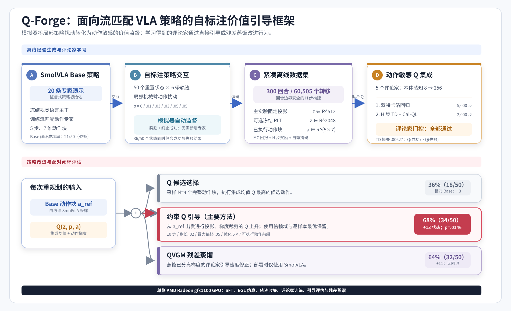
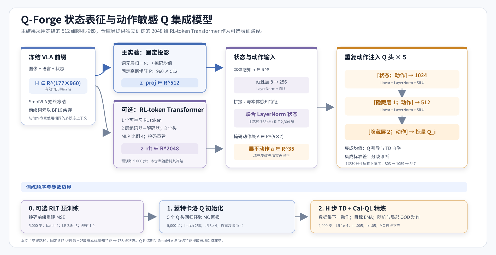

# Q-Forge：面向 AMD Radeon 上流匹配视觉-语言-动作策略的自标注 Q 引导

**技术报告**<br>
**作者：** Yuhao Cao<br>
**代码仓库：** `ZorAttC/Q-Forge`<br>
**应用方向：** 物理人工智能 / 机器人操作

## 摘要

视觉-语言-动作（Vision-Language-Action，VLA）策略可以通过预训练获得广泛的感知与语义先验，但其下游操作性能仍受到专家演示数量与覆盖范围的强烈制约。收集更多遥操作轨迹成本高昂，而仅进行监督微调无法提供直接机制，以区分学习策略所访问状态下局部更优与局部更差的动作。

本报告提出 **Q-Forge**，一种面向流匹配 SmolVLA 策略的自标注策略改进流水线。Q-Forge 从一个使用 20 条 LIBERO 演示微调的 SmolVLA-450M 模型开始。随后，该策略在小幅动作扰动下收集 300 条模拟器回滚轨迹；任务奖励和终止成功信号无需额外专家标注即可自动标记所得经验。由五个成员组成的保守 Q 集成模型在紧凑的冻结 VLA 特征和五步动作块上训练，先进行蒙特卡洛回归，再进行带 Cal-QL 风格正则化的 H 步时序差分学习。部署时，投影 Q 梯度上升在有界信赖域内修改每个动作块。可选的 Q 值梯度匹配残差目标将这些修正蒸馏到策略中，从而移除推理路径中的评论家模型。

在 LIBERO-Spatial 任务 7 的 50 个重置状态上进行配对评估，并为每种方法使用相同的推理种子后，20 条演示训练的基础（Base）策略在 21/50 个状态上成功（42%），而 Q 引导（Q-guidance）在 34/50 个状态上成功（68%）。Q 引导将 19 个 Base 失败转化为成功，同时使 6 个 Base 成功发生退化，净增 13 个状态和 26 个百分点（`p=0.0146`，精确双侧 McNemar 检验）。无评论家的残差蒸馏达到 32/50（64%），而无梯度 Q 选择达到 18/50（36%）。在同一套件的任务 3（*拿起曲奇盒上的黑碗并将其放到盘子上*）上进行的第二次受控复制中，Base 为 38/50（76%），Q 引导在无成功状态退化的情况下达到 44/50（88%）（`p=0.03125`），残差蒸馏达到 43/50（86%），而 Q 选择为 35/50（70%）——在第二个任务中复现了与任务 7 相同的方法排序。包括策略训练、模拟器数据收集、评论家学习、引导评估、残差蒸馏和注意力基准测试在内的完整流水线，均在一块具有 48 GiB 显存的 AMD Radeon `gfx1100` GPU 上执行。

**关键词：** 视觉-语言-动作模型、机器人学习、离线强化学习、流匹配、Q 引导、自标注数据、LIBERO、ROCm

## 1. 引言

近期的 VLA 模型将机器人控制表述为条件序列生成：将视觉观测、语言指令和本体感知状态映射为离散动作、连续动作或短动作块。该范式的规模化发展产生了具有越来越广泛语义能力的策略，但下游适配仍高度依赖专家演示。这种依赖带来了两个相互关联的局限。

首先，专家数据集通常覆盖成功的标称行为，而非学习策略所诱导的分布。因此，微小误差可能使机器人进入策略缺少纠正性监督的状态。其次，行为克隆将演示动作视为目标，却不会显式估计附近的替代动作是否能够改善长期任务结果。除非系统能够评估并利用动作之间的相对质量，否则仅从同一策略采样更多动作并不能解决这一问题。

仿真为额外监督提供了实用途径。策略可以与环境交互，而环境能够在无需人工标注的情况下分配奖励和成功标签。然而，任意收集策略回滚轨迹并不足够。如果从某个给定初始状态出发的每条轨迹都具有相同结果，学习到的评论家可能主要识别简单与困难状态，而不是学习对动作敏感的局部结构。因此，Q-Forge 强调**同状态动作覆盖**：多条轨迹从每个重置状态开始，并通过对策略动作施加受控扰动而产生差异。由此得到的成功与失败混合结果提供了局部证据，说明哪些动作方向会改变任务结果。

Q-Forge 研究以下问题：

> 能否将自动标注、由策略生成的交互数据转化为紧凑流匹配 VLA 策略的可靠局部动作修正，而无需收集更多专家演示？

本项目有五项主要贡献：

1. 围绕 SmolVLA 实现端到端自标注改进闭环，涵盖模拟器交互、特征缓存、离线评论家训练、测试时引导和残差策略蒸馏。
2. 提出一种结构化局部扰动收集协议，在固定重置状态下产生结果多样性，并证明这种覆盖比仅在较小数据集上延长优化更重要。
3. 开发一种有界动作块引导过程，其中包含梯度裁剪、动作范围投影、以 Base 为中心的信赖域以及逐样本保留最优保障。
4. 比较同一学习价值信号的三种用法：候选选择、直接梯度引导和无评论家的残差蒸馏。
5. 记录在 AMD ROCm 上运行完整工作流所需的系统工程，包括针对不同阶段选择注意力后端，以及用于分离残差目标的稳定 CPU 评论家路径。

本文的实证主张刻意限定在较窄范围内：主要研究涵盖一个 LIBERO 任务、50 个重置状态和一个配对推理种子。结果证明了受控的任务内改进，而非多任务、多种子、真实机器人或仿真到现实的泛化。

## 2. 相关工作

### 2.1 视觉-语言-动作策略

RT-1 [1] 证明 Transformer 策略可以扩展到跨多项任务的真实世界机器人控制；RT-2 [2] 将机器人动作表述为视觉-语言模型的另一种输出模态，并研究网络规模语义知识向控制任务的迁移。OpenVLA [3] 进一步建立了开放的 VLA 模型与训练生态系统。这些系统推动了将语义感知与低层动作生成视为统一模型的思路，但其适配质量仍取决于机器人数据和下游优化过程。

SmolVLA [4] 以紧凑的 450M 参数 VLA 面向经济且高效的机器人应用。它将冻结或部分冻结的视觉-语言骨干网络与使用流匹配生成连续动作块的动作专家（Action Expert）相结合。Q-Forge 采用 SmolVLA，是因为其紧凑架构适合在单块 GPU 上运行，并且其连续动作生成器支持基于价值梯度的局部优化。Q-Forge 不替换 SmolVLA 架构，而是在其周围增加一个由交互驱动的价值学习与策略改进层。

### 2.2 生成式策略与流匹配

Diffusion Policy [5] 表明，富有表达力的生成模型能够有效处理多模态视觉运动行为与动作序列预测。流匹配（Flow Matching）[6] 为学习在分布之间传输样本的连续向量场提供了无需仿真的目标。在机器人动作策略中，模型可以从噪声开始积分学习到的速度场，以得到结构化动作块。

生成式策略具有较强表达能力，但与显式确定性行动者相比，传统策略梯度或行动者-评论家更新并不直接。通过每个去噪步骤进行反向传播成本高昂且可能不稳定，而基于似然的策略改进也未必能以便利形式获得。Q-Forge 转而研究可执行动作空间中的局部优化，以及将评论家诱导的修正蒸馏到速度场中。

### 2.3 离线强化学习与保守价值估计

离线强化学习从固定交互数据集中学习，且必须避免为数据支持范围之外的动作分配不切实际的高价值。保守 Q 学习（Conservative Q-Learning，CQL）[7] 通过惩罚相对于数据集动作而言采样到的分布外动作的高价值来解决这一问题。Cal-QL [8] 为保守预训练加入校准，使学习到的价值相对于参考策略保持适当尺度。

Q-Forge 在轻量级动作块评论家中使用这些思想。均匀随机动作块和围绕行为动作局部扰动的动作块构成保守候选，而蒙特卡洛回报提供校准下界。本文不声称评论家在全局范围内准确；其训练目标是在策略分布附近提供有用的局部排序与梯度。因此，集成分歧和留出诊断被视为必要检查，而非正确性的证明。

### 2.4 Q 引导的流匹配策略改进

Q-VGM [9] 为流匹配 VLA 策略的离策略强化学习构建了 Q 值梯度匹配方法。其核心见解是，评论家梯度可以为流策略定义有用修正，而无需在部署时对完整去噪轨迹进行微分。

Q-Forge 是受这一方向启发的独立系统实现和受控研究。其重点是在 AMD 硬件上围绕 SmolVLA 构建完整闭环：自标注局部回滚轨迹收集、紧凑的冻结前缀评论家、受约束的测试时动作上升、配对闭环评估，以及可选的残差蒸馏。直接 Q 引导路径是主要方法；残差价值梯度匹配则作为面向部署的替代方案进行评估。

### 2.5 机器人学习基准

LIBERO [10] 是一个用于知识迁移和终身机器人操作的基准。它提供语言条件仿真任务、演示和可复现初始状态。Q-Forge 使用 LIBERO-Spatial 任务 7——*拿起炉子上的黑碗并将其放到盘子上*——作为主要受控环境，并在同一套件的任务 3（*拿起曲奇盒上的黑碗并将其放到盘子上*）上进行复制实验，模拟器在其中提供自动奖励和成功标签。本文使用该基准进行任务内策略改进，而非终身学习评估。

## 3. 问题定义

令观测为

```math
o_t=(I_t^{agent}, I_t^{wrist}, p_t, \ell),
```

其中，两幅图像描述场景，`p_t` 为本体感知，`\ell` 为语言指令。流匹配策略 `\pi_\theta` 生成一个动作块

```math
a_{t:t+H-1}\in[-1,1]^{H\times D},
```

其中时域长度 `H=5`，可执行动作维度 `D=7`。环境返回奖励和终止成功指示器。目标是在满足以下条件时提高闭环成功率：

- 除初始监督数据集之外，不使用其他专家演示；
- 保留预训练 VLA 表征；
- 将策略修正限制在 Base 动作的小邻域内；
- 仅从一组固定的自动标注策略回滚轨迹中学习。

该流水线将表征、价值学习和动作改进分离。冻结的 SmolVLA 前缀提供紧凑状态特征，评论家估计候选动作块的回报，而引导仅改变呈现给评论家的动作变量。

## 4. Q-Forge 方法



### 4.1 Base 流匹配策略

Base 策略是通过原生 LeRobot 训练路径微调的 SmolVLA-450M。视觉-语言骨干网络被冻结，动作专家在 20 条专家演示上优化 20,000 步。

对于干净的归一化动作块 `x_0`、高斯噪声 `x_1` 和插值时间 `t\in[0,1]`，前向插值为

```math
x_t=(1-t)x_0+t x_1.
```

动作专家预测条件速度

```math
v^*(x_t,t)=x_1-x_0
```

并使用流匹配损失

```math
\mathcal L_{\mathrm{flow}}
=
\mathbb E\left[
\left\|v_\theta(x_t,t,o_t)-(x_1-x_0)\right\|_2^2
\right].
```

推理时，数值积分从 `t=1` 的噪声开始，朝 `t=0` 的动作块推进。

### 4.2 自标注局部回滚轨迹收集

Base 策略在模拟器中从重置状态 0–49 开始闭环运行。每个状态收集六个回合，并分配如下动作噪声标准差：

```math
\{0.00,\;0.01,\;0.03,\;0.03,\;0.05,\;0.05\}.
```

每次重新规划时，以 `0.5` 的概率将分配的扰动施加到前六个机械臂动作维度；夹爪维度保持不受扰动。收集的数据包含：

| 数量 | 值 |
|---|---:|
| 重置状态 | 50 |
| 每个状态的回滚轨迹数 | 6 |
| 回合 | 300 |
| 转移 | 60,505 |
| 同时包含成功和失败的状态 | 36/50 |

“自标注”意味着轨迹由学习到的策略生成，并由模拟器奖励和终止成功信号自动标注。这些标签不是模型生成的伪标签。未使用额外的人工演示或手工轨迹标注。

重复状态设计是核心。每组六条回滚轨迹内仅由状态决定的难度近似固定，而动作扰动会改变轨迹。因此，混合结果提供了关于局部动作敏感性的证据，而不只是关于哪些初始状态较为简单的证据。

### 4.3 动作块转移构建

每个回合被独立转换为经过填充的 H 步转移，因此动作块和自举目标绝不会跨越回合边界。对于从时间 `t` 开始的转移，动作块奖励为

```math
R_t^{(H)}
=
\sum_{k=0}^{H-1}\gamma^k r_{t+k},
```

其中不可用的终止步骤被掩蔽。自举折扣为 `\gamma^{h_t}`，其中 `h_t\le H` 是有效步骤数。数据集还存储完整蒙特卡洛回报

```math
G_t=\sum_{k=0}^{T-t}\gamma^k r_{t+k}.
```

### 4.4 状态表征：主实验固定投影与可选 RLT

Q-Forge 对图像、语言和状态复用完全相同的冻结 SmolVLA 前缀路径。令
`H_t\in\mathbb R^{L\times d}` 为前缀隐藏序列，`m_t` 为其有效性掩码。
仓库实现了两种互斥的压缩路径。

#### 4.4.1 主实验：固定随机投影

主 300P 实验应用逐词元层归一化、掩码均值池化和固定高斯随机投影：

```math
z_t^{proj}
=
\left(
\frac{\sum_j m_{t,j}\operatorname{LN}(H_{t,j})}
{\sum_j m_{t,j}}
\right)P,
\qquad
z_t^{proj}\in\mathbb R^{512}.
```

投影矩阵 `P` 使用种子 1000 可复现地生成，且不参与训练。主流水线
`run_task7_native20d_qvgm_rollouts300.sh` 调用特征缓存脚本时只传入
`--feature-dim 512 --projection-seed 1000`，没有传入 `--rlt-checkpoint`。
因此，本文 42%→68% 的主要 Q 引导结果使用的是该固定 512 维表征，而
不是 RLT。

#### 4.4.2 可选路径：RL token Transformer（RLT）

仓库还实现了与 Q-VGM 论文表征方式对齐的 RL token 路径 [11]，并在代码
与配置中将其简称为 RLT；对应类名为 `RLTTokenTransformer`。该路径先将
冻结 SmolVLA 前缀词元缓存为

```math
H_t\in\mathbb R^{177\times960},
```

再使用带一个可学习 RL token 的 Transformer 编码器—解码器，将整段前缀
压缩为

```math
z_t^{rlt}\in\mathbb R^{2048}.
```

本仓库的默认 RLT 配置为 2 层、8 个注意力头、MLP 扩展比 4、一个 RL
token。解码器根据 `z_t^{rlt}` 重建有效前缀词元，训练目标是掩码均方误差：

```math
\mathcal L_{\mathrm{RLT}}
=
\frac{
\sum_{j=1}^{L}m_{t,j}
\left\|\hat H_{t,j}-H_{t,j}\right\|_2^2
}{
d\sum_{j=1}^{L}m_{t,j}
}.
```

`train_rlt_prefix_autoencoder.py` 的默认训练配置为 5,000 步、批量大小 4、
学习率 `2.5\times10^{-5}`、AdamW 权重衰减 `10^{-10}`、梯度范数上限
1.0，并在 BF16 下训练。验证同时报告重建 MSE 与有效词元上的平均余弦
相似度。数据按照完整回合划分；也可以指定重置状态作为独立验证集合，从而
避免同一回合的词元同时进入训练与验证。

RLT 预训练结束后，`load_rlt_extractor` 会加载编码器并冻结 SmolVLA 与
RLT 的全部参数；评论家训练只读取缓存的 2048 维 `z_t^{rlt}`。这与 Q-VGM
论文中“评论家训练时继续联合优化编码器并保留重建正则项”的做法不同：
本仓库采用**先独立重建预训练、再冻结特征提取器**的工程实现。RLT 路径由
`cache_qvgm_features.py --rlt-checkpoint ... --prefix-token-dir ...` 显式
启用，相关 `rlt2048` 配置属于单独实验，不是本报告主 300P 数字的来源。

### 4.5 动作敏感的 Q 集成模型



评论家估计五步动作块的期望回报：

```math
Q_i(z_t,p_t,a_{t:t+H-1}).
```

首先将 8 维本体感知输入编码为 256 维：

```math
e_t^p
=
\operatorname{SiLU}
\left(
\operatorname{LN}(W_p p_t+b_p)
\right)
\in\mathbb R^{256}.
```

主实验将 `z_t^{proj}` 与 `e_t^p` 拼接并进行联合层归一化，得到 768 维
状态；RLT 路径则得到 2,304 维状态：

```math
s_t^{proj}=\operatorname{LN}([z_t^{proj};e_t^p])\in\mathbb R^{768},
```

```math
s_t^{rlt}=\operatorname{LN}([z_t^{rlt};e_t^p])\in\mathbb R^{2304}.
```

动作掩码先将填充步骤清零，再把 `5\times7` 动作块展平为
`\tilde a_t\in\mathbb R^{35}`。五个独立初始化的 MLP 评论家构成集成模型。
每个 Q 头都在每一层重新拼接动作：

```math
h_1
=
\operatorname{SiLU}
\left(
\operatorname{LN}
\left(
W_1[s_t;\tilde a_t]+b_1
\right)
\right)
\in\mathbb R^{1024},
```

```math
h_2
=
\operatorname{SiLU}
\left(
\operatorname{LN}
\left(
W_2[h_1;\tilde a_t]+b_2
\right)
\right)
\in\mathbb R^{512},
```

```math
Q_i(s_t,a_t)=W_3[h_2;\tilde a_t]+b_3.
```

对于主固定投影路径，三个线性层的输入维度分别为 803、1,059 和 547。
重复动作注入可避免 35 维动作信号被更大的状态向量淹没，并直接保证
`Q_i` 对动作保持可微。

主要聚合方式是集成均值：

```math
\bar Q(z,p,a)=\frac{1}{E}\sum_{i=1}^{E}Q_i(z,p,a),
\qquad E=5.
```

集成标准差被记录为分歧诊断指标。实现还保留了悲观最小值聚合方式以保持兼容性，但报告中的时序差分（TD）目标、候选选择和引导均使用集成均值。

### 4.6 两阶段评论家训练

完整训练顺序如下。RLT 阶段仅在选择 RLT 特征路径时执行。

| 阶段 | 可训练参数 | 目标 | 主配置 |
|---|---|---|---|
| 可选 RLT 预训练 | RLT 编码器—解码器 | 前缀重建 MSE | 5,000 步，batch 4，LR `2.5e-5` |
| Q 阶段 1 | 本体感知编码器、归一化层、5 个 Q 头 | MC 回报回归 | 5,000 步，batch 256，LR `3e-4` |
| Q 阶段 2 | 同上；另维护冻结目标集成 | H 步 TD + Cal-QL | 2,000 步，batch 256，LR `1e-4` |

无论选择固定投影还是 RLT，SmolVLA 主干在 Q 训练期间均保持冻结。主实验
还将重置状态 40–49 的完整轨迹排除在 Q 参数更新之外，用于评论家诊断与
引导网格选择。

#### 阶段 1：蒙特卡洛回归

评论家首先拟合经验回报，共进行 5,000 个优化器步骤：

```math
\mathcal L_{\mathrm{MC}}
=
\frac{1}{E}\sum_{i=1}^{E}
\mathbb E_{(s,a,G)\sim\mathcal D}
\left[(Q_i(s,a)-G)^2\right].
```

该阶段直接根据完整结果初始化价值尺度。

#### 阶段 2：H 步 TD 学习与保守校准

随后，评论家使用缓慢更新的目标集成模型训练 2,000 步。自举目标为

```math
y_t
=
R_t^{(H)}
+
\gamma^{h_t}b_t
\bar Q_{\bar\phi}(s_{t+H},a^{\mathcal D}_{t+H}),
```

其中，`b_t` 在回合边界处为零，否则为一；`a^{\mathcal D}_{t+H}` 是固定回滚轨迹数据集中记录的下一动作块。TD 目标为

```math
\mathcal L_{\mathrm{TD}}
=
\frac{1}{E}\sum_{i=1}^{E}
\mathbb E\left[(Q_i(s_t,a_t)-y_t)^2\right].
```

对于保守正则化，将每个数据集动作与均匀随机动作块以及以记录的行为动作为中心的高斯扰动进行比较。对数均值指数项惩罚缺乏支持的高价值：

```math
\mathcal L_{\mathrm{CQL}}
=
\mathbb E_s
\left[
\operatorname{LME}_{a\sim\mathcal A_{\mathrm{cand}}}Q(s,a)
-Q(s,a_{\mathcal D})
\right].
```

蒙特卡洛回报提供应用于保守候选的 Cal-QL 风格校准下界。最终阶段使用批量大小 256、学习率 `10^{-4}`、Polyak 系数 `\tau=0.005`、保守权重 `0.05`、十个均匀候选，以及局部扰动标准差 `0.05`。

### 4.7 评论家验收门槛

在进行闭环引导之前，评论家必须满足四个预定义条件：

1. 留出集 TD 损失低于 `0.01`；
2. 成功轨迹的平均价值高于失败轨迹；
3. 数据集动作的平均价值高于随机动作；
4. 关于动作的梯度有限且非零。

这些测试会拒绝那些虽能拟合标量回报，却无法提供可用局部动作几何结构的评论家。

### 4.8 受约束 Q 引导

令 `a^{ref}` 为 Base 策略采样的动作块。引导初始化 `a_0=a^{ref}`，并执行投影梯度上升：

```math
\tilde a_{k+1}
=
a_k
+
\eta\,
\operatorname{clipnorm}
\left(
\nabla_a\bar Q(z,p,a_k),g_{\max}
\right),
```

```math
a_{k+1}
=
\Pi_{
[a^{ref}-\delta,\;a^{ref}+\delta]
\cap[-1,1]
}
(\tilde a_{k+1}).
```

仅优化已配置的可执行前缀和动作维度。被掩蔽或填充的元素保持与 Base 动作块相同。对于每个样本，算法记录预测 Q 最高的迭代结果，并将未经修改的 Base 动作纳入候选。因此，引导不会返回预测集成均值 Q 低于参考动作的动作，尽管这一保障无法保证真实环境结果更好。

选定配置为：

```text
gradient steps:             10
step size:                  0.02
maximum Base-centered delta: 0.05
gradient norm cap:          1.0
optimized chunk prefix:     5 steps
optimized action dimensions: 7
```

### 4.9 Q 选择基线

Q 选择采样四个独立策略动作块，使用集成均值评估每个动作块，并执行其中的最大值：

```math
a^*
=
\arg\max_{a^{(n)},\,n\in\{1,\dots,4\}}
\bar Q(s,a^{(n)}).
```

该方法在不使用动作梯度的情况下使用评论家。它检验仅依赖候选排序是否足够，而不是从 Base 动作出发沿局部价值增大方向移动。

### 4.10 残差价值梯度匹配

可选残差策略将评论家生成的改进蒸馏到 SmolVLA 动作专家中。在去噪时间 `t`，冻结的 Base 速度生成干净动作估计

```math
x_0^{base}=x_t-t\,v_{base}(x_t,t).
```

该动作从模型归一化坐标映射到可执行环境坐标，通过受约束 Q 引导进行改进，再映射回来得到 `x_0^*`。分离的目标速度残差为

```math
u_t=\frac{x_0^{base}-x_0^*}{t}.
```

从 Base 策略初始化的学生模型最小化

```math
\mathcal L_{\mathrm{res}}
=
\mathbb E_t
\left[
w(t)
\left\|
\left(v_\theta-v_{base}\right)-u_t
\right\|_2^2
\right],
\qquad
w(t)=(1-t)^p.
```

仅动作专家和动作/时间投影层可训练。VLA 前缀保持冻结，Base 教师保持冻结，梯度不经过评论家或引导目标。部署使用标准 SmolVLA 架构，不需要评论家评估。

主要残差实验使用 1,000 个优化器步骤、批量大小 8、学习率 `10^{-5}`、十个去噪步骤，以及较小的目标引导配置：五个上升步骤、步长 `0.005`、最大增量 `0.02`。

## 5. 实验设置

### 5.1 任务与观测

受控研究使用 LIBERO-Spatial 任务 7：

> 拿起炉子上的黑碗并将其放到盘子上。

策略接收智能体视角图像、腕部视角图像、本体感知状态和语言指令。它预测七维连续动作，并在重新规划前执行五个动作。

第 6.5 节还报告了同一套件中任务 3（*拿起曲奇盒上的黑碗并将其放到盘子上*）上的复制实验，以检验方法排序是否跨任务一致。

### 5.2 数据与划分

| 数据集 | 规模 | 作用 |
|---|---:|---|
| 专家演示 | 10、20 或 50 个回合 | SFT 研究 |
| 主要专家集 | 20 个回合 | Base 初始化 |
| 纯 Base 回滚轨迹 | 50 个回合 | 早期评论家/残差研究 |
| 扰动子集 | 50 个回合 | 数据量消融 |
| 主要扰动集 | 300 个回合 / 60,505 个转移 | 评论家和残差训练 |

重置状态 0–39 用于训练评论家。状态 40–49 留作用于评论家诊断和引导网格选择。最终闭环汇总报告状态 0–49，因此引导验证状态包含在最终基准中。所以，不应将该结果描述为在完全未触及的测试状态划分上的性能。

### 5.3 配对闭环协议

```text
task suite / task: libero_spatial / 7
reset states:      0-49
episodes/method:   50
inference seed:    2001
maximum steps:     240
actions/replan:    5
attention backend: PyTorch SDPA MATH
```

每个回合开始前都会重新设置随机生成器种子。每种候选方法均使用与 Base 策略相同的重置状态和推理种子进行评估。这种配对设计揭示了仅从总体成功率中无法看到的改进与退化。

### 5.4 指标与统计分析

主要指标是任务成功率。Wilson 95% 置信区间描述二项不确定性。对于每种候选方法，配对结果划分为：

- 相对于 Base 的失败到成功转移；
- 相对于 Base 的成功到失败转移。

精确双侧 McNemar 检验用于评估两个不一致计数是否对称。由于研究仅使用 50 个配对状态，因此除 p 值外，还同时报告效应量和完整转移计数。

## 6. 结果

### 6.1 主要配对比较


| 方法 | 成功 | Wilson 95% CI | 失败→成功 | 成功→失败 | 净状态数 | 精确 p |
|---|---:|---:|---:|---:|---:|---:|
| 20-demo SmolVLA Base | 21/50 (42%) | 29.38%–55.77% | — | — | — | — |
| Q selection, `N=4` | 18/50 (36%) | 24.14%–49.86% | 0 | 3 | −3 | 0.25 |
| **Q-guidance** | **34/50 (68%)** | **54.19%–79.24%** | **19** | **6** | **+13** | **0.0146** |
| QVGM residual | 32/50 (64%) | 50.14%–75.86% | 11 | 0 | +11 | 0.00098 |

Q 引导取得最高成功率。相对于 Base，它提升 26 个百分点，并净增 13 个成功重置状态。其 19 次改进和 6 次退化表明，该效果并非对所有困难状态的一致挽救；学习到的评论家有时会推荐局部看似合理、却损害闭环执行的修正。尽管如此，具有统计显著性的不对称仍支持固定协议下的正向配对效果。

残差蒸馏的总体表现略弱，但在本次评估的 21 个 Base 成功状态上没有出现退化。其 64% 的成功率值得注意，因为部署既不需要评论家，也不需要迭代动作优化。然而，直接方法和残差方法在训练/推理期间使用不同的引导配置，因此这两个数值应被解释为已评估的系统变体，而非纯粹控制延迟的消融实验。

Q 选择使性能降至 36%。能够提供有用局部梯度的评论家，不一定能可靠地对独立采样的完整动作块进行排序，从而改善闭环性能。在这一设置下，结果支持受约束的局部修正，而非不受约束的候选替换。

### 6.2 评论家诊断

| 诊断项 | 值 | 门槛 |
|---|---:|---|
| 留出集 TD 损失 | `0.006273849` | `< 0.01` |
| `Q(success)` | `0.421292` | 大于失败 |
| `Q(failure)` | `0.234153` | — |
| `Q(dataset)` | `0.287930` | 大于随机 |
| `Q(random)` | `-0.361172` | — |
| 集成分歧 | `0.014425` | 诊断项 |
| 动作梯度范数 | `0.007519` | 有限且非零 |

评论家通过所有预定义门槛。成功与失败结果之间的分离表明其对回报敏感，而数据集动作与随机动作之间的差距符合对无支持动作进行保守处理的预期。对于引导而言最重要的是，动作梯度有限且非零。

### 6.3 引导网格验证

网格涵盖 5 或 10 个梯度步骤、步长 `{0.005, 0.01, 0.02}`，以及最大增量 `{0.02, 0.05}`。所有 12 种配置均通过评论家门槛。在 12,124 个验证转移上，选定的 `10 / 0.02 / 0.05` 配置得到：

| 指标 | 值 |
|---|---:|
| 平均预测 Q 增量 | `0.044556` |
| 预测 Q 改善的样本 | `100%` |
| 平均绝对动作位移 | `0.008992` |
| 最大绝对位移 | `0.050000` |
| 动作饱和度增量 | `0.003132` |
| 引导前分歧 | `0.015009` |
| 引导后分歧 | `0.017363` |

保留最优规则解释了预测 Q 以 100% 比例非递减。适中的平均位移和较小的饱和度增量表明，选定配置通常进行局部改变，而非趋向边界的改变。上升后的集成分歧增加警示我们，即使在较小信赖域内，优化也可能将动作推向不确定性更高的区域。

### 6.4 数据覆盖消融与负面证据

从 50 条未扰动 Base 回滚轨迹训练的早期残差实验，在 500 步时达到 36%，在 1,000 步时达到 40%。加入置信度门控和 Base 锚定并未弥补数据限制，结果为 28%。包含 50 个回合的扰动子集达到 46%，而从完整的 300 回合扰动集进行残差蒸馏达到 64%。

这些结果支持以下假设：**局部结果多样性是主要的使能变量**。更长时间的优化和更复杂的正则化无法替代如下证据：相似状态下的不同动作如何改变结果。该结果具有相关性，而非完整的全因子研究，但与现有消融结果一致。

### 6.5 跨任务复制：LIBERO-Spatial 任务 3（曲奇盒）

为检验主结果是否仅适用于任务 7，我们在同一 LIBERO-Spatial 套件的任务 3
（*拿起曲奇盒上的黑碗并将其放到盘子上*）上复现了完全相同的 20D+300P 链路。
任务 3 的 20 条演示从公共 `libero_spatial_image` LeRobot v3.0 数据集中按
固定规则切片（按全局 episode index 排序的前 20 集），重编码为与任务 7
相同的 128×128 `agentview`/`wrist` 原生数据集；SFT、300 条扰动回滚轨迹收集、
评论家训练与配对评测协议全部与任务 7 保持一致。

数据与评论家诊断（任务 3）：

| 数量 | 值 |
|---|---:|
| 回滚轨迹 | 300（50 状态 × 6） |
| 转移 | 38,509 |
| 采集成功率 | 75%（225/300） |
| 混合结果状态 | 22/50 |
| 留出集 TD 损失 | `0.0121366`（门槛 `< 0.01`，**未通过**） |
| `Q(success)` / `Q(failure)` | `0.6477` / `0.2765` |
| `Q(dataset)` / `Q(random)` | `0.4317` / `-0.3149` |
| 动作梯度范数 | `0.005338`（有限非零） |

任务 3 的评论家通过成功/失败与数据集/随机排序检查，但留出集 TD 损失为
门槛的 1.21 倍，因此引导网格 12 种配置全部不可用（0/12），按预注册协议
在线引导使用保守预设 `5 / 0.005 / 0.02`，其结果明确标记为诊断性结果。

四路配对结果（states 0-49，seed 2001，action/replan 5）：

| 方法 | 成功 | Wilson 95% CI | 失败→成功 | 成功→失败 | 净状态数 | 精确 p |
|---|---:|---:|---:|---:|---:|---:|
| 20-demo SmolVLA Base | 38/50 (76%) | 62.59%–85.70% | — | — | — | — |
| Q selection, `N=4` | 35/50 (70%) | 56.25%–80.90% | 1 | 4 | −3 | 0.375 |
| **Q-guidance（保守预设）** | **44/50 (88%)** | **76.20%–94.38%** | **6** | **0** | **+6** | **0.03125** |
| QVGM residual | 43/50 (86%) | 73.81%–93.05% | 6 | 1 | +5 | 0.125 |

跨任务对比：

| 任务 | Base | Q selection | Q guidance | QVGM residual |
|---|---:|---:|---:|---:|
| 任务 7（评论家通过门槛，TD 0.0063） | 42% | 36% | 68%（+13，p=0.015） | 64%（+11，p=0.001） |
| 任务 3（评论家未过门槛，TD 0.0121） | 76% | 70% | 88%（+6，p=0.031） | 86%（+5，p=0.125） |

两个任务上的方法排序完全一致：**Q-guidance 均为提升最大且唯一具有统计
显著性的路径，且 QVGM 残差蒸馏位居第二**。值得注意的差异如下：任务 3 的
Q-guidance 在 6 次改进中没有造成任何 Base 成功状态退化（任务 7 为 19 改进
/ 6 退化）；尽管其评论家未通过严格的留出集 TD 门槛，保守引导仍产生了显著
配对提升，这与任务 7 上使用 50 条扰动回滚轨迹的引导结果（+8，p=0.039，
同样未通过门槛）一致。任务 3 的 Base 本身更强（76% 对 42%，成功轨迹
平均约 88 步，明显短于任务 7 的 139 步），说明价值引导的价值并不局限于
弱策略。Q selection 在第二个任务上再次给出负面证据（−3），强化了
"引导利用局部动作方向，而非依赖评论家对独立采样完整块的排序"这一结论。

## 7. AMD Radeon 与 ROCm 系统研究

### 7.1 硬件与软件

所有报告阶段均在一台具有以下配置的服务器上运行：

```text
GPU architecture: gfx1100
Compute units:    96
VRAM:             51,522,830,336 bytes (approximately 48 GiB)
ROCm runtime:     7.2.4
PyTorch build:    2.8.0+rocm6.4
Python:           3.11
Rendering:        EGL / headless MuJoCo
```

系统报告通用 AMD 产品字符串，因此项目通过架构、计算单元数量和显存来标识测试设备，而不是推断零售显卡型号。PyTorch 软件包带有 ROCm 6.4 构建标签，并在较新的已安装运行时/驱动程序栈上执行。

### 7.2 稳定的残差训练路径

初始残差实验在第一次优化器更新前，于冻结的 FP32 评论家路径中遇到原生 `SIGSEGV`。仅切换注意力实现未能消除该故障。稳定实现采用以下方式：

1. 强制 SmolVLA 训练注意力使用 PyTorch SDPA MATH；
2. 在 CPU 上评估冻结的评论家，以构建分离的 Q 引导目标；
3. 仅将目标修正传输到 GPU；
4. 仅保留通过学生动作专家的梯度。

这种划分在数学上有效，因为目标被有意分离。批量大小为一的前向/反向检查成功完成，损失为 `0.00149`，GPU 峰值显存为 2604 MiB，SDPA 与 eager 注意力之间的最大差异为 `2.98e-7`。

### 7.3 注意力后端基准

对 CK FlashAttention、AMD Triton FlashAttention 和 PyTorch SDPA 进行了基准测试，涵盖 FP16/BF16、因果/非因果注意力、序列长度 256–4096、批量大小 8、16 个头，以及头维度 64。每种情况使用五次预热迭代和二十次计时迭代。

对于序列长度 4096 的 FP16 因果注意力：

| 后端 | 前向 TFLOP/s | 反向 TFLOP/s | 完整步骤 | 峰值显存 |
|---|---:|---:|---:|---:|
| CK | 57.71 | 8.26 | 88.20 ms | 742 MiB |
| Triton | 16.62 | 8.93 | 93.31 ms | 614 MiB |
| SDPA | 12.23 | 15.49 | 66.82 ms | 744 MiB |

没有任何后端在每个阶段都占优。CK 更适合仅前向的策略推理和回滚轨迹收集，SDPA 更适合反向传播和完整训练步骤，而 Triton 适合峰值分配比吞吐量更重要的情况。这一结果也表明，仅使用前向 TFLOP/s 不足以作为后端选择标准。

### 7.4 SmolVLA 端到端策略推理优化

除注意力算子微基准外，本项目还针对 SmolVLA 的完整
`predict_action_batch()` 路径进行了无需重新训练的低漂移推理优化。这里的计时
范围严格限定为**策略自身的一次重新规划（replan）**，不包含 LIBERO 环境重置、
MuJoCo 仿真步进、视频编码或其他回滚轨迹开销。因此，本节报告的是策略推理延迟，
而不是完整 rollout 的墙钟时间。

优化不改变模型权重、网络结构、动作时域、每次重新规划返回的动作数或流匹配去噪
步数。最终接受的部署组合包含以下改动：

1. **自动融合 SDPA。** 将注意力后端设置为 `sdpa_auto`，允许
   PyTorch/ROCm 为实际张量形状选择融合 SDPA 实现，而不是强制
   `SDPBackend.MATH`。
2. **推理模式。** 使用 `torch.inference_mode()`，移除纯部署路径不需要的
   autograd 元数据维护。
3. **固定去噪循环。** 使用配置中已知的固定迭代次数控制十步去噪循环，避免每一步
   读取 GPU 标量作为 Python 循环条件所引入的同步；Euler 更新顺序与运算保持不变。
4. **不变量缓存。** 对任务字符串和设备不变的语言 token ID、attention mask，以及
   静态 VLM/Action Expert 层引用进行复用。
5. **轻量输出。** 纯动作部署时只返回执行所需的动作，省略用于评论家训练、Q 引导
   和数据收集的 RL 中间载荷。需要 Q-guidance 或特征采集时，该开关必须关闭。

验证使用同一 checkpoint、固定 observation、任务、重置状态、推理种子和显式 flow
noise。Base 与优化路径各预热 5 次并计时 30 次，测量顺序交替；GPU 在
`predict_action_batch()` 前后立即同步。结果如下：

| 指标 | 原始路径 | 优化路径 | 变化 |
|---|---:|---:|---:|
| 中位策略延迟 / replan | `321.7635 ms` | `289.2548 ms` | `-10.1033%` |
| 中位延迟 / 已执行动作 | `64.3527 ms` | `57.8510 ms` | `-10.1033%` |
| P10 延迟 / replan | `313.1312 ms` | `288.0216 ms` | — |
| P90 延迟 / replan | `362.0245 ms` | `300.0382 ms` | — |
| 相对加速 | `1.0000×` | `1.11239×` | `+11.239%` |

这里的 P10 和 P90 分别表示 10% 与 90% 分位延迟，用于描述单次推理时延分布，
而不是成功率或置信区间。优化路径不仅降低中位数，也将 P10–P90 的主体区间从约
`313.1–362.0 ms` 收紧至 `288.0–300.0 ms`。原始样本中仍存在少量系统级长尾，
因此正文使用对离群值更稳健的中位数作为主要延迟指标。

优化前后动作并非逐位完全相同，但漂移很小：最大绝对动作差异为
`9.2876e-4`，平均绝对差异为 `1.8328e-4`。这符合本项目允许“差异极小”的
推理优化边界，但不应表述为严格 bitwise-equivalent。随后在 LIBERO-Spatial
任务 7、重置状态 1 上进行了 20 步闭环 smoke test，动作均保持有限值且执行路径
正常。

在上述冻结部署组合之上，还评估了去噪布局缓存：将十步循环中不变的 suffix
布尔 attention mask 和 position ID 移到循环外构建，但不缓存动作、时间嵌入、
hidden state 或 attention 输出。20 次增量比较得到
`290.1827 → 289.2843 ms/replan`，额外降低 `0.3096%`；最大和平均动作差异分别为
`4.4155e-4` 与 `8.707e-5`。该收益较小，因此作为可选增量优化单独报告，而没有
混入上述已经冻结的 `10.1033%` 主结果。删除 residual clone 的候选优化没有改善
实测延迟，故被明确保留为关闭状态。

注意力微基准中 CK 在某些长序列前向形状上明显快于 SDPA，但这没有自动转化为
完整 SmolVLA 策略的同等加速。一次 replan 还包含视觉—语言前缀、mask 与位置编码
构造、十步 Action Expert 去噪、张量整理和 Python 调度；实际形状也不等于第 7.3
节的 `B=8, H=16, D=64, L=4096` 合成形状。因此，最终部署后端依据完整策略延迟
选择为 `sdpa_auto`，而不是依据单个 attention kernel 的峰值 TFLOP/s 选择 CK。

所有改动均为显式 opt-in 开关，可独立关闭并回退到原始路径。复现实验可运行：

```bash
python scripts/benchmark_smolvla_policy_latency.py \
  --model-path /path/to/pretrained_model \
  --warmup 5 --repeats 30 \
  --compare-inference-optimization \
  --optimization deployment_bundle \
  --optimized-backend sdpa_auto \
  --out reports/inference_optimization_final_gfx1100.json
```

部署脚本为：

```bash
./scripts/run_smolvla_inference_optimized.sh \
  --model-path /path/to/pretrained_model \
  --task-id 7 --task-reset-state-id 1 --seed 2001 \
  --action-steps 5 --max-steps 240 --no-video
```

完整原始计时样本保存在
`reports/inference_optimization_final_gfx1100.json`，而各项开关、可选布局缓存结果和
回退配置记录在 `reports/inference_optimization_change_record.md`。这些优化的目标是
降低标准 Base 或残差策略的推理开销；直接 Q-guidance 仍需额外的评论家前向与动作
梯度计算，其总延迟应另行测量，不能直接由本节数字推断。

## 8. 讨论

### 8.1 局部扰动数据为何有效

评论家被用作微分对象：引导依赖 Base 动作附近的 `\nabla_a Q(s,a)`。学习这种梯度需要在保持状态上下文近似固定的同时，使动作和结果发生变化。六条回滚轨迹的设计直接创造了这种结构。相比之下，每个状态仅包含一条回滚轨迹的数据集可以支持状态价值区分，却会使局部动作导数难以辨识。

### 8.2 引导为何优于选择

来自高维动作生成器的独立样本可能在许多坐标以及整个时域上存在差异。对它们进行排序要求评论家在更广泛的候选分布上保持准确。投影上升从分布内 Base 动作开始，并在严格的最大增量约束下沿局部梯度移动。因此，它对评论家的要求更低：需要有用的局部几何结构，而非全局可靠的排序。

### 8.3 直接引导与蒸馏

直接引导在每次重新规划时都保留对评论家的访问，并取得最高成功率，但会在推理中增加多次评论家前向/反向计算。残差蒸馏将这些计算移至离线阶段，并部署标准策略，从而降低延迟和集成复杂度。其略低的成功率反映了从分离的局部目标中学习速度场修正所涉及的额外近似。

### 8.4 信赖域的作用

信赖域不能证明安全性，但它限制外推，并将 Base 策略保留为行为先验。投影还可以防止无效动作范围，而保留最优机制可以防止预测价值降低。直接引导下观察到的六次 Base 成功退化表明，这些机制是保障措施，而非保证；然而在任务 3 的复制实验中，保守引导在 6 次改进中实现零退化，说明退化率对任务难度与评论家校准敏感，而非不可避免。

## 9. 局限与有效性威胁

1. **任务数量有限。** 主结果涵盖一个 LIBERO-Spatial 任务，跨任务复制实验仅增加第二个任务（任务 3）。方法排序在两个任务上一致，但其他任务中的物体几何形状、奖励密度和恢复行为可能不同，尚不足以支持广泛泛化声明。
2. **单一配对推理种子。** 配对降低了方法之间的方差，但无法确立不同策略采样种子下的稳健性。
3. **验证重叠。** 状态 40–49 用于引导选择，并包含在最终的 50 状态基准中。
4. **评估样本较小。** 五十个配对回合支持有用的受控比较，但置信区间仍然较宽。
5. **模拟器标签。** 自动监督的正确性取决于环境奖励和成功规范的正确性。
6. **无真实机器人证据。** 本报告不对硬件迁移、接触安全性或仿真到现实的稳健性作出声明。
7. **交互并非免费。** 该方法消除的是额外人工标注，而非模拟器计算、存储或策略与环境的交互。
8. **评论家不确定性并不完整。** 较低的集成分歧并不意味着认知不确定性已校准或梯度正确。
9. **消融并非完全全因子。** 数据集大小、扰动多样性、优化时长和残差设置并未在所有组合中独立变化。
10. **硬件结论特定于工作负载。** 注意力结果适用于所测量的形状、软件版本和 `gfx1100` 环境。

未来评估应将验证状态与最终测试状态分离，纳入多个任务和推理种子，比较不同扰动调度，并在与本节相同的同步计时协议下，分别测量直接 Q-guidance 的评论家梯度开销和残差策略的完整部署延迟。真实机器人研究还需要明确的动作安全约束，并谨慎处理奖励规范。

## 10. 可复现性与制品边界

代码仓库包括源代码、配置、单元测试和协议测试、紧凑且经过审计的结果摘要、可视化资源，以及复现命令。权威的紧凑指标位于：

- `results/main_results.json`；
- `results/critic_and_guidance.json`。

由于体积较大，大型模型检查点、原始回滚轨迹数据集、图像缓存和训练日志未纳入 Git。其预期路径和从头生成过程记录在 `docs/REPRODUCTION.md` 中。

最小源代码级验证路径为：

```bash
python -m pip install -e .
python scripts/verify_rocm_torch.py
python -m pytest -q
```

完整 LIBERO 复现还需要安装兼容版本的 LIBERO-sim、LeRobot 0.4.1、RLinf 0.3.0、MuJoCo/EGL，以及文档中所述的模型和数据集制品。

## 11. 结论

Q-Forge 证明，当所收集数据被设计为揭示局部动作与结果结构时，紧凑 VLA 策略能够从自身自动标注的模拟器交互中得到改进。从仅 20 条专家演示开始，该系统使用 300 条经过扰动的策略回滚轨迹训练保守动作块 Q 集成模型。随后，投影 Q 梯度引导在固定的 50 状态 LIBERO 协议上将配对闭环成功率从 42% 提高至 68%，净增 13 个重置状态，且具有统计显著性。无评论家的残差蒸馏以 64% 保留了大部分改进，而 Q 选择提供了负面证据，表明仅依赖评论家的排序并不足够。在第二个 LIBERO-Spatial 任务上的复制实验中，相同的方法排序再次出现：Q-guidance 将强得多的 Base（76%）提升至 88%（净增 6 个状态，零退化，`p=0.031`），残差蒸馏达到 86%，Q selection 再次未能改善（70%），从而确立了跨任务的可复现模式，而不仅仅是单一任务的偶然结果。

核心实证结论不只是更多回滚轨迹数据有所帮助，而是**具有混合结果的重复局部覆盖使评论家具有可操作性**。系统研究还表明，AMD Radeon 上的端到端 VLA 强化学习受益于针对不同阶段选择内核，而非使用单一通用注意力后端。这些结果共同确立了 Q-Forge 作为单 GPU 可复现原型的地位，用于流匹配机器人策略的自标注、价值引导改进，同时清楚界定了更广泛泛化声明所需的额外证据。

## 参考文献

[1] A. Brohan et al.，“RT-1：面向真实世界控制的机器人 Transformer 规模化研究”，arXiv:2212.06817，2022。<https://arxiv.org/abs/2212.06817>

[2] A. Brohan et al.，“RT-2：视觉-语言-动作模型将网络知识迁移至机器人控制”，arXiv:2307.15818，2023。
<https://arxiv.org/abs/2307.15818>

[3] M. J. Kim et al.，“OpenVLA：开源视觉-语言-动作模型”，arXiv:2406.09246，2024。<https://arxiv.org/abs/2406.09246>

[4] M. Shukor et al.，“SmolVLA：面向经济高效机器人应用的视觉-语言-动作模型”，arXiv:2506.01844，2025。
<https://arxiv.org/abs/2506.01844>

[5] C. Chi et al.，“Diffusion Policy：通过动作扩散学习视觉运动策略”，arXiv:2303.04137，2023。
<https://arxiv.org/abs/2303.04137>

[6] Y. Lipman, R. T. Q. Chen, H. Ben-Hamu, M. Nickel, and M. Le，
“生成建模的流匹配”，arXiv:2210.02747，2022。
<https://arxiv.org/abs/2210.02747>

[7] A. Kumar, A. Zhou, G. Tucker, and S. Levine，“面向离线强化学习的保守 Q 学习”，Advances in Neural Information Processing Systems，2020。<https://arxiv.org/abs/2006.04779>

[8] N. Nakamoto et al.，“Cal-QL：用于高效在线微调的校准离线强化学习预训练”，arXiv:2303.05479，2023。
<https://arxiv.org/abs/2303.05479>

[9] Z. Wang, Y. Liu, X. Mao, M. Wang, and Y. Mu，“Q-VGM：流匹配 VLA 离策略强化学习的 Q 值梯度匹配”，
arXiv:2606.08015，2026。<https://arxiv.org/abs/2606.08015>

[10] B. Liu et al.，“LIBERO：终身机器人学习知识迁移基准”，arXiv:2306.03310，2023。
<https://arxiv.org/abs/2306.03310>

[11] C. Xu, J. T. Springenberg, M. Equi, A. Amin, A. Esmail, S. Levine, and
L. Ke，“RL Token：使用视觉-语言-动作模型引导在线强化学习”，
arXiv:2604.23073，2026。<https://arxiv.org/abs/2604.23073>

## 作者贡献

**Yuhao Cao** 是唯一开发者，负责项目构想、系统设计、实现、AMD ROCm 适配、实验、评估、可视化和文档编写。
