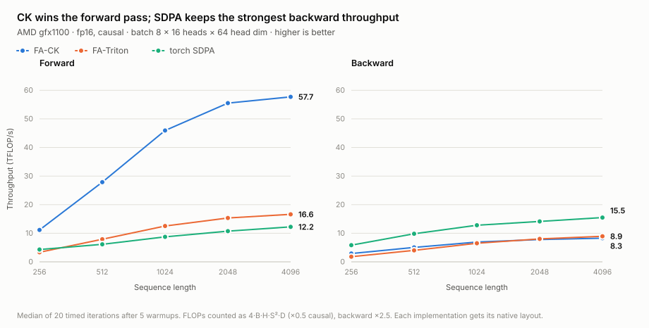
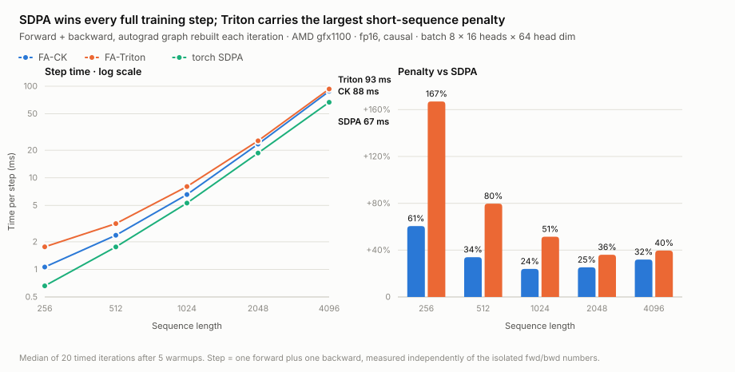

# CK、Triton 与 torch SDPA 注意力基准（gfx1100 / ROCm）

本报告比较同一张 AMD `gfx1100` GPU 上的三条融合注意力路径：

- **FA-CK**：本机编译并安装的 `flash_attn 2.8.4` CK wheel；
- **FA-Triton**：`/workspace/flash-attention` 源码树的 AMD Triton 后端；
- **torch SDPA**：PyTorch 2.8.0 ROCm 的融合 SDPA。

原始数据和可视化：

- [完整 JSON](attention_bench_gfx1100.json)
- [吞吐量 SVG](attention_bench_gfx1100.svg)
- [训练步 SVG](attention_step_gfx1100.svg)
- [交互 HTML](attention_bench_gfx1100.html)
- [CK 正确性验证](attention_validation_ck_gfx1100.json)
- [Triton 正确性验证](attention_validation_triton_gfx1100.json)
- [benchmark 脚本](../scripts/benchmark_attention_fa_vs_sdpa.py)
- [后端验证脚本](../scripts/validate_attention_backend.py)
- [绘图脚本](../scripts/plot_attention_bench.py)

## 结论

三条路径没有一个在所有阶段都占优：

| 用途 | 最优路径 | 实测结论 |
|---|---|---|
| 纯前向、推理、rollout | **FA-CK** | fp16 causal 比 SDPA 快 2.58–5.25× |
| 反向 | **torch SDPA** | CK 只有 SDPA 的 0.50–0.55×；Triton 为 0.31–0.58× |
| 完整训练步 | **torch SDPA** | CK 慢 24–61%；Triton 慢 36–167% |
| 显存（本形状） | **FA-Triton** | S=4096 时 614 MiB，CK 742 MiB，SDPA 744 MiB |

对 QVGM/SmolVLA 的直接建议：

- rollout 和纯推理可以优先使用 CK FlashAttention；
- 有反向传播的训练继续使用 torch SDPA；
- 当前 Triton 后端主要价值是较低峰值显存，而不是速度；
- 选择必须按 forward-only 与 training 分开，不能只根据前向 TFLOP/s 决定。

## 图 1：前向与反向吞吐量



图中展示训练相关的 `fp16 + causal` 切片。CK 前向随序列长度快速爬升，在
S=4096 达到 57.7 TFLOP/s；Triton 为 16.6 TFLOP/s，SDPA 为 12.2 TFLOP/s。
反向排序反过来：SDPA 达到 15.5 TFLOP/s，Triton 8.9，CK 8.3。

## 图 2：完整训练步



完整 step 每次重建 autograd 图，并独立计时，不是简单将孤立的 forward 和
backward 数字相加。所有序列长度上 SDPA 都最快。

## fp16 causal 详细结果

吞吐量列单位为 TFLOP/s，step 列单位为 ms：

| S | CK fwd | Triton fwd | SDPA fwd | CK bwd | Triton bwd | SDPA bwd | CK step | Triton step | SDPA step |
|---:|---:|---:|---:|---:|---:|---:|---:|---:|---:|
| 256 | 11.15 | 3.35 | 4.32 | 2.91 | 1.80 | 5.84 | 1.06 | 1.76 | 0.66 |
| 512 | 27.86 | 7.89 | 6.13 | 5.06 | 4.01 | 9.82 | 2.36 | 3.16 | 1.76 |
| 1024 | 45.94 | 12.54 | 8.75 | 6.92 | 6.50 | 12.80 | 6.56 | 8.02 | 5.30 |
| 2048 | 55.51 | 15.34 | 10.72 | 7.79 | 8.04 | 14.13 | 23.35 | 25.36 | 18.63 |
| 4096 | 57.71 | 16.62 | 12.23 | 8.26 | 8.93 | 15.49 | 88.20 | 93.31 | 66.82 |

相对 SDPA 的完整 step 额外耗时：

| S | FA-CK | FA-Triton |
|---:|---:|---:|
| 256 | +60.5% | +167.0% |
| 512 | +33.9% | +79.7% |
| 1024 | +23.9% | +51.5% |
| 2048 | +25.3% | +36.1% |
| 4096 | +32.0% | +39.6% |

Triton 在 S=1024–4096 的前向略快于 SDPA，但不足以抵消其反向劣势。CK 的
前向优势非常明显，也同样被更慢的反向吃掉。

## 全部 dtype / mask 配置的相对范围

每个范围均为“该后端相对 SDPA 的速度倍数”；大于 1 表示更快：

| 配置 | CK fwd | CK bwd | CK step | Triton fwd | Triton bwd | Triton step |
|---|---:|---:|---:|---:|---:|---:|
| fp16 causal | 2.58–5.25× | 0.50–0.55× | 0.62–0.81× | 0.78–1.43× | 0.31–0.58× | 0.37–0.73× |
| fp16 非 causal | 1.79–3.09× | 0.49–0.60× | 0.59–0.66× | 0.56–0.93× | 0.48–0.63× | 0.51–0.68× |
| bf16 causal | 2.72–4.87× | 0.49–0.53× | 0.62–0.77× | 0.81–1.42× | 0.31–0.56× | 0.39–0.71× |
| bf16 非 causal | 1.82–2.94× | 0.50–0.60× | 0.60–0.65× | 0.57–0.93× | 0.47–0.61× | 0.50–0.66× |

CK 在所有 20 个配置的前向都快于 SDPA。Triton 只在 causal 且序列足够长时
略快于 SDPA；非 causal 前向始终落后。两种 FA 后端在所有 20 个配置的完整
训练 step 都落后于 SDPA。

## 测试稳定性与合并有效性

CK 与 Triton 分两次完整运行。两次运行都先预编译所有 dtype、mask 和序列长度
组合，再开始计时，以避免 Triton JIT/autotune 污染另一后端的计时。

| 指标 | 结果 |
|---|---:|
| CK 单次运行首尾 stability probe 漂移 | 0.36% |
| Triton 单次运行首尾 stability probe 漂移 | 0.50% |
| 两次运行 SDPA step 平均差异 | 0.59% |
| 两次运行 SDPA step 最大差异 | 2.64% |

因此使用 CK 运行中的 SDPA 作为共同基准，并将 Triton 列合并进同一 JSON 是合理
的。`sdpa_rerun_*` 字段仍保留在 JSON 中，可审计第二次运行的原始 SDPA 数字。

## 数值正确性与梯度

benchmark JSON 中，两后端全部 20 个配置均有独立 parity 字段：

- `parity_max_abs_err_flash_attn`
- `parity_max_abs_err_flash_attn_triton`

全 sweep 最大绝对误差：FP16 下 CK 最大 1.95e-3、Triton 最大 9.77e-4；
BF16 下两后端最大均为 7.81e-3，符合对应低精度舍入量级。

另外，`validate_attention_backend.py` 对 CK 和 Triton 各自重新执行了：

- FP16/BF16；
- causal/非 causal dense forward；
- dense backward；
- packed varlen，序列长度 `[73, 128, 191]`；
- 输出及 q/k/v 梯度有限性检查。

两后端全部通过。独立验证的最大误差为：

| 路径 | FP16 dense/varlen 最大误差 | BF16 dense/varlen 最大误差 | 输出/梯度有限 |
|---|---:|---:|---|
| CK | 9.77e-4 | 3.91e-3 | 是 |
| Triton | 9.77e-4 | 3.91e-3 | 是 |

## CK varlen 补丁

原始 wheel 的 CK `flash_attn_varlen_func` Python/C++ 参数数不一致。当前环境已在：

```text
.venv-rocm/lib/python3.11/site-packages/flash_attn/flash_attn_interface.py
```

移除 Python 侧多传的尾部 `num_splits`，备份为同目录
`flash_attn_interface.py.orig`。本报告的 CK varlen forward/backward 验证是在该
补丁生效后通过的。重新安装 wheel 会覆盖补丁；长期方案应将修正后的文件重新
打包进 wheel。Triton varlen 不需要该补丁。

## 测试环境与方法

| 项 | 值 |
|---|---|
| GPU | AMD Radeon Graphics，`gfx1100`，48 GiB 可见显存 |
| PyTorch | 2.8.0+rocm6.4 |
| HIP runtime | 6.4.43482-0f2d60242 |
| FA-CK | flash_attn 2.8.4，模块 `flash_attn_2_cuda` |
| FA-Triton | flash_attn 2.8.3.post1 源码路径，AMD Triton backend |
| Python | 3.11.15 |
| 形状 | batch 8 × 16 heads × head_dim 64 |
| sweep | FP16/BF16 × causal/非 causal × S=256…4096 |
| 计时 | 5 次 warmup + 20 次计时取中位数，每次同步 GPU |
| FLOPs | `4·B·H·S²·D`，causal ×0.5，backward ×2.5 |

FA 使用原生 `B,S,H,D`，SDPA 使用原生 `B,H,S,D`，不把 transpose 计入 kernel
时间。SDPA 的峰值显存随序列长度近似线性增长，并非 math 注意力矩阵回退。

## 复现

CK：

```bash
cd /workspace/QVGM
.venv-rocm/bin/python scripts/benchmark_attention_fa_vs_sdpa.py \
  --out reports/attention_bench_gfx1100.json
```

Triton 使用同样的预编译协议并合并：

```bash
env PYTHONPATH=/workspace/flash-attention \
  FLASH_ATTENTION_TRITON_AMD_ENABLE=TRUE \
  .venv-rocm/bin/python scripts/benchmark_attention_fa_vs_sdpa.py \
  --merge-into reports/attention_bench_gfx1100.json \
  --out reports/attention_bench_gfx1100.json
```

正确性与绘图：

```bash
.venv-rocm/bin/python scripts/validate_attention_backend.py \
  --out reports/attention_validation_ck_gfx1100.json

env PYTHONPATH=/workspace/flash-attention \
  FLASH_ATTENTION_TRITON_AMD_ENABLE=TRUE \
  .venv-rocm/bin/python scripts/validate_attention_backend.py \
  --out reports/attention_validation_triton_gfx1100.json

.venv-rocm/bin/python scripts/plot_attention_bench.py
```

## 适用边界

- 结论只适用于当前 `gfx1100`、软件版本和测试形状；不能外推至 MI250/MI300。
- 未测 MQA/GQA、head_dim ≠ 64、dropout、ALiBi、滑动窗口及 varlen 吞吐量。
- varlen 本次只验证数值和 backward 可用性，没有做性能对比。
- GPU 未锁频，但预编译后的首尾/跨运行漂移均低，结论排序稳定。
- 若 CK backward 或 Triton kernel 后续更新，需要完整重测，而不是复用当前图表。
